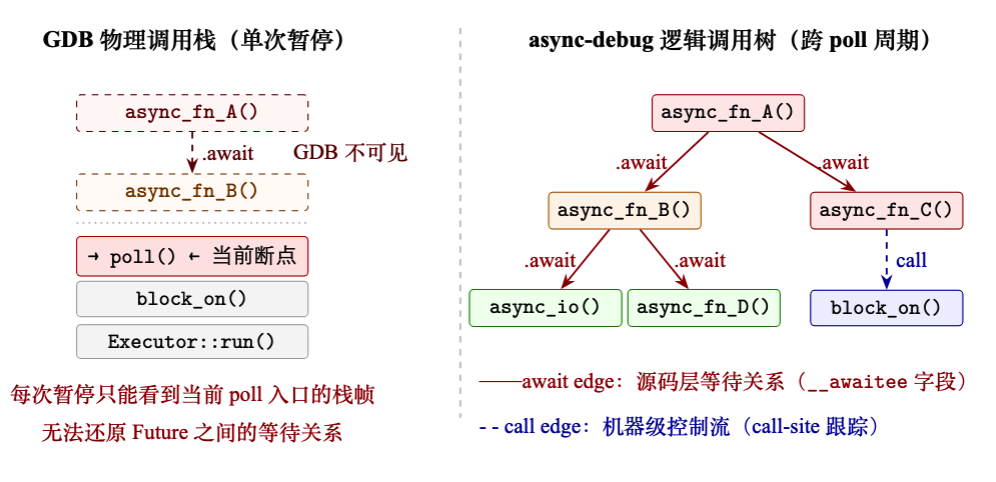
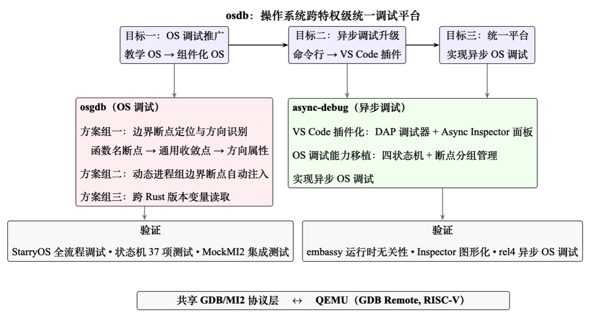
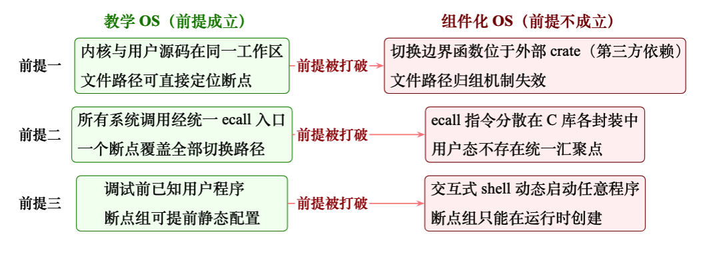
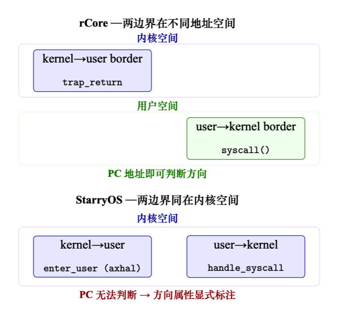
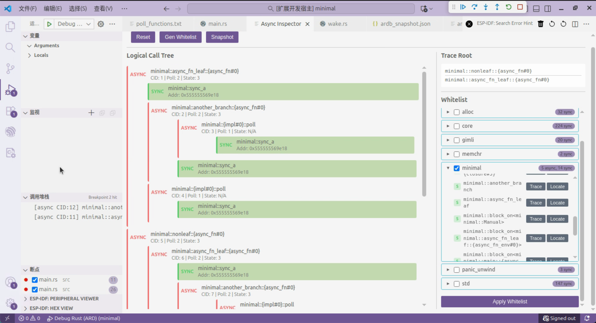
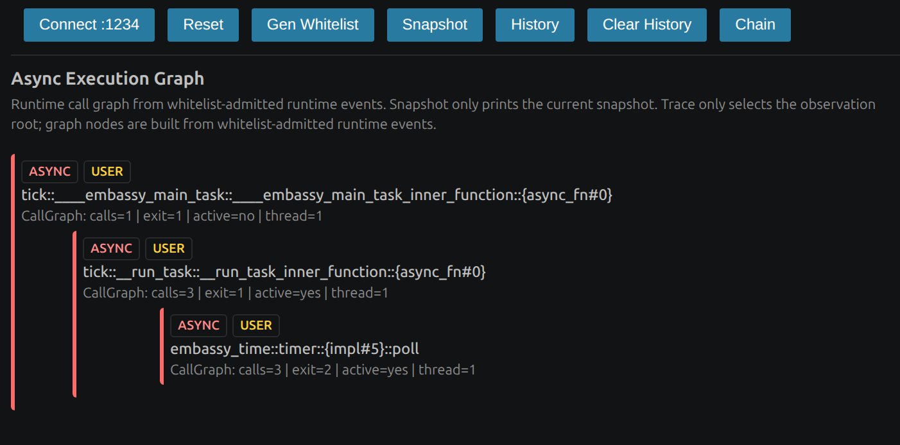

<p align="center">
  
</p>

# 操作系统跨特权级统一调试平台

## 一、基本信息

### 1.1 项目信息

| **赛题**     | [proj55-源代码级内核调试器](https://github.com/chenzhiy2001/code-debug) |
| ------------ | ------------------------------------------------------------ |
| **队伍名称** | 做什么都会成功队                                             |
| **学校**     | 北京工商大学                                                 |
| **小组成员** | 曾小红、王浩铭、武雪妍                                       |
| **指导老师** | 吴竞邦                                                       |

### 1.2 摘要

调试操作系统内核的难点在于，内核态和用户态使用完全不同的符号表与断点集合，每次特权级切换都需要调试器手动干预。当操作系统本身采用 Rust 异步编程模型时，async 函数的物理调用栈与逻辑执行流之间还存在第二层断裂——开发者即使看到了栈帧，也难以理解「当前在等待谁、为什么会执行到这里」。

该项目是一个面向操作系统的跨特权级统一调试平台，由两个子系统构成。

**osgdb** 负责特权级切换时的断点组与符号表自动管理：通过四状态机驱动内核态/用户态的无缝切换，并提出边界断点方向属性与通用 syscall handler 方案，将 user→kernel 方向的 N 个切换点收敛为唯一的系统调用分发函数，以单个断点覆盖所有系统调用返回路径。

**async-debug** 负责异步执行流的逻辑还原：基于 await edge 与 call edge 双关系恢复方法，将编译后分散的 poll 事件重建为开发者可读的逻辑依赖树，并通过 Async Inspector 图形化面板呈现。两个子系统共享 GDB/MI2 协议层。

今年的工作围绕三个递进目标展开：

（1）将 OS 调试从教学 OS（rCore）推广到组件化 OS（StarryOS），后者在源码组织、系统调用路径、进程模型上与前者存在根本差异；

（2）将异步调试从命令行原型升级为 VS Code 插件，提供图形化的异步执行拓扑展示；

（3）将两项能力合并，探索异步操作系统的调试。

### 1.3 完成情况

项目代码分布在两个仓库中：
- **osgdb**：涉及特权级切换的源代码级 OS 调试工具。GitHub 地址：[https://github.com/OSDebugger/osgdb](https://github.com/OSDebugger/osgdb)
- **async-debug**（本仓库）：基于 GDB 的 Rust 异步执行混合跟踪调试器

目前，赛题完成度如下：

| 目标 | 完成情况 | 说明 |
| :--- | :------: | :--- |
| [osgdb] StarryOS 适配：建立通用边界断点方法论 | **全部完成** | 提出三组方案：边界断点定位与方向识别（函数名断点、syscall handler 收敛点、方向属性）；动态进程组自动注入；Hook 断点跨 Rust 版本变量读取。已在 StarryOS 上完成全流程验证 |
| [osgdb] 降低新 OS 适配配置复杂度 | **部分完成** | 已实现源码注释标记扫描（自动定位断点行号），替代手写文件路径+行号配置；关键配置项自动推导仍在进行 |
| [osgdb] 特权级切换性能优化 | **待实现** | 当前逐指令单步执行效率低，shell 交互中单字符可触发多次符号文件重载，延迟达秒级；计划用 GDB finish 命令和切换冷却期机制优化 |
| [async-debug] VS Code 插件化与图形界面 | **全部完成** | 实现标准调试器扩展；自建 Async Inspector 面板，以树形图展示异步执行拓扑，标注协程 ID、poll 次数、运行状态；白名单全流程 UI 集成；与原生调用栈形成「物理流+逻辑流」双轨协同 |
| [async-debug] OS 调试能力移植 | **全部完成** | 将四状态机与断点分组管理移植至 async-debug，实现 Attach 模式+QEMU 集成；编写 37 个状态机单元测试全部通过 |
| [async-debug] 实际项目验证（embassy） | **全部完成** | 在无外部异步运行时的嵌入式框架 embassy 上完成异步追踪测试，验证了工具不依赖特定异步运行时的核心主张 |
| [async-debug] 异步操作系统调试（rel4） | **进行中** | 面临两个困难：页表切换导致跨地址空间状态不可读；Release 编译优化消去状态机内部结构 |

详细开发进度请参考[开发进度](docs/开发进度.md)。

### 1.4 项目分工

| **成员** | **主要分工**                                                                                 |
| -------- | -------------------------------------------------------------------------------------------- |
| 曾小红   | StarryOS 适配与验证、async-debug 插件设计与实现、Async Inspector 面板、async-debug 的 OS 调试功能移植、embassy 验证、撰写参赛文档、演示视频录制 |
| 王浩铭   | 复现 2023–2024 年 code-debug 的前序工作；文档测试章节的撰写 |
| 武雪妍   | 图片制作、PPT 制作 |

### 1.5 文档索引

- [操作系统跨特权级统一调试平台](#操作系统跨特权级统一调试平台)
  - [一、基本信息](#一基本信息)
    - [1.1 项目信息](#11-项目信息)
    - [1.2 摘要](#12-摘要)
    - [1.3 完成情况](#13-完成情况)
    - [1.4 项目分工](#14-项目分工)
    - [1.5 文档索引](#15-文档索引)
  - [二、项目背景](#二项目背景)
    - [2.1 操作系统调试：特权级切换与断点组管理](#21-操作系统调试特权级切换与断点组管理)
    - [2.2 异步操作系统调试：执行流的不透明性](#22-异步操作系统调试执行流的不透明性)
    - [2.3 核心挑战](#23-核心挑战)
  - [三、核心目标与完成情况](#三核心目标与完成情况)
    - [3.1 核心目标](#31-核心目标)
    - [3.2 OS 调试推广至组件化操作系统（StarryOS 适配）](#32-os-调试推广至组件化操作系统starryos-适配)
    - [3.3 异步调试图形化升级](#33-异步调试图形化升级)
    - [3.4 异步操作系统调试（进行中）](#34-异步操作系统调试进行中)
    - [3.5 后续工作与展望](#35-后续工作与展望)
  - [四、核心工作分述](#四核心工作分述)
    - [4.1 边界断点的定位与方向识别（方案组一）](#41-边界断点的定位与方向识别方案组一)
      - [4.1.1 函数名断点：定位外部依赖中的切换函数](#411-函数名断点定位外部依赖中的切换函数)
      - [4.1.2 通用收敛点方案：一个断点覆盖全部返回路径](#412-通用收敛点方案一个断点覆盖全部返回路径)
      - [4.1.3 方向属性：区分同地址空间内的进出方向](#413-方向属性区分同地址空间内的进出方向)
    - [4.2 动态进程组的边界断点自动注入（方案组二）](#42-动态进程组的边界断点自动注入方案组二)
    - [4.3 跨 Rust 版本的变量读取（方案组三）](#43-跨-rust-版本的变量读取方案组三)
    - [4.4 Async Inspector：异步执行拓扑的图形化展示](#44-async-inspector异步执行拓扑的图形化展示)
  - [五、测试与验证](#五测试与验证)
    - [5.1 测试环境](#51-测试环境)
    - [5.2 OSStateMachine 单元测试](#52-osstatemachine-单元测试)
    - [5.3 OS 调试流程集成测试](#53-os-调试流程集成测试)
    - [5.4 StarryOS 完整配置与验证](#54-starryos-完整配置与验证)
    - [5.5 embassy 实际项目验证](#55-embassy-实际项目验证)
  - [六、总结与决赛计划](#六总结与决赛计划)
    - [6.1 核心成果](#61-核心成果)
    - [6.2 决赛计划](#62-决赛计划)
  - [七、功能展示](#七功能展示)
    - [演示视频](#演示视频)
  - [八、项目文档](#八项目文档)
    - [1. 文档 PDF](#1-文档-pdf)
    - [2. 初赛 PPT](#2-初赛-ppt)
  - [九、参考说明](#九参考说明)
    - [9.1 前序工作](#91-前序工作)
    - [9.2 被调试目标](#92-被调试目标)
    - [9.3 参考文档](#93-参考文档)

## 二、项目背景

### 2.1 操作系统调试：特权级切换与断点组管理

用 GDB 调试一个普通用户程序时，开发者只需要加载一次符号表，之后所有的断点设置和堆栈回溯都在同一个地址空间内完成。但调试操作系统内核时，情况完全不同：内核态和用户态使用不同的页表、不同的地址空间，更重要的是使用完全不同的符号表（即调试信息文件）。当 CPU 在两种特权级之间切换时，调试器必须同步切换符号表——否则断点将命中错误的地址，堆栈回溯也毫无意义。

如果由开发者手动完成这一过程，每次特权级切换都需要依次执行：卸载旧符号文件、加载新符号文件、逐一清除旧断点、逐一恢复新断点。在操作系统启动过程中，内核与用户态之间会发生数十次切换，手动操作根本不可行。

前序工作（2023–2025年）已通过四状态机驱动的断点组管理机制解决了上述基础问题：调试器自动识别当前所在的特权级，并在内核态与用户态的断点组之间自动切换，开发者只需在对应源码位置正常设置断点即可。这一机制在 rCore 等教学操作系统上得到了验证。

### 2.2 异步操作系统调试：执行流的不透明性

操作系统内核需要同时处理大量并发 I/O 请求，Rust 的 async/await 机制提供了一种轻量级的方案。编译器将 async 函数编译为一个状态机，只有当外部调度器来驱动它时（这个操作叫 poll），它才往前走一步，遇到 .await 就暂停，几乎不占用栈空间。这一特性使得用 Rust 编写异步操作系统内核成为趋势——zCore 等项目已明确提出「利用 Rust 异步机制优化内核并发性能」。

然而，这一编译模型也带来了调试层面的困难。编译器将 async 函数拆分为多个 poll 阶段后，函数的逻辑执行流被切分为离散的状态片段。每次 GDB 暂停时，它看到的物理调用栈只能看到当前这一次 poll 的入口，无法呈现「这个 Future 在等待哪个 Future」「控制流是怎样经过多个 poll 周期走到这里的」。

前序工作（2025年）围绕这一难题提出了核心观察：要解释一次 Rust 异步执行，仅恢复「谁在等待谁」（称为 await edge）是不够的，还必须同时恢复「这次真实控制流是怎样推进到这里的」（称为 call edge）。基于此提出了 await edge 与 call edge 双关系恢复的混合跟踪方法，以及基于 `(poll_symbol, env_ptr)` 的实例级识别和白名单机制。但 2025 年的实现仅为 GDB 内部的 Python 脚本——开发者只能在终端查看文本输出，今年需完成 VS Code 插件化升级。



### 2.3 核心挑战

基于对操作系统调试技术现状的分析，本项目需要应对以下关键挑战：

1. **组件化 OS 的适配挑战**。前序工作在 rCore 等教学 OS 上验证的机制，依赖三个与 OS 源码组织相关的隐含假设：内核与用户程序源码在同一工作区（可通过文件路径区分断点归属的特权级）；所有系统调用经过用户态统一的 ecall 入口（一个断点即可覆盖全部进出路径）；调试开始前就知道要运行哪些用户程序（断点组可提前静态配置）。然而，组件化 OS（如 StarryOS）不满足这三个假设，这意味着断点定位、方向判断、进程组管理都需要重新设计。

2. **异步调试的工程化升级**。2025 年提出的双关系恢复方法在命令行原型中验证了可行性，但结果只能以文本形式在终端输出，对于包含数十个协程的实际异步程序难以阅读。需要将这套方法升级为完整的 VS Code 调试器插件，构建图形化的异步执行拓扑展示界面。

3. **异步与特权级的交叉**。当异步操作系统同时涉及特权级切换和异步执行追踪时，两个子系统需要协调工作：四状态机驱动的断点组切换和 await/call edge 恢复需要在一个统一平台上运行，这是实现「Rust 异步操作系统调试」的关键前提。

## 三、核心目标与完成情况

### 3.1 核心目标

今年的工作围绕三个递进目标展开：

- [X] **目标一：将 OS 调试从教学 OS 推广到组件化 OS**。突破三个隐含假设，使状态机和断点组机制在无本地源码、无统一 ecall 入口、动态进程组的场景下仍能正确工作。
- [X] **目标二：将异步调试从命令行原型升级为 VS Code 插件**。完成标准 DAP 调试器扩展，自建 Async Inspector 图形化面板，并在实际异步项目上验证运行时无关性。
- [ ] **目标三：将两项能力合并，探索异步操作系统的调试**。同时启用特权级切换管理和异步执行流还原（进行中）。



### 3.2 OS 调试推广至组件化操作系统（StarryOS 适配）

前序工作的三个隐含假设在组件化 OS 上全部不成立：



针对这些困难，我们提出了三组方案（详见第四章）：

**方案组一：边界断点的定位与方向识别。** 三个子问题构成一条因果链——引入函数名断点突破外部 crate 的文件路径限制；以内核态系统调用分发函数为 user→kernel 方向的通用收敛点，一个断点覆盖全部系统调用返回路径；引入方向属性消除同地址空间内的方向歧义。

**方案组二：动态进程组的边界断点自动注入。** 通过待注入队列机制，保证任意时刻动态创建的进程组自动继承 user→kernel 方向的边界断点，维持切换链条的完整闭合。

**方案组三：Hook 断点处的跨 Rust 版本变量读取。** 利用 GDB/MI 协议中 console 输出的顺序性保证，在协议层自建输出捕获机制，将数据结构解析交给 GDB pretty printer、内存读取和字节重构由调试器完成，自动兼容所有 Rust 版本。

### 3.3 异步调试图形化升级

- **为异步执行流构建图形化展示界面**。VS Code 的调试界面只认识线程、栈帧和变量，不理解异步程序中的「等待链」。我们在插件中自建 Async Inspector 面板：以多根节点树形图展示 await edge 和 call edge 组成的逻辑调用关系；节点按颜色区分 async 协程与 sync 同步函数，标注协程 ID、被 poll 次数、运行状态等异步信息；白名单生成、编辑、Trace 启动的全流程集成于面板。
- **在实际异步项目上验证方法的通用性**。选用嵌入式异步框架 embassy 进行测试——embassy 没有使用 Tokio 等外部异步运行时，完全依靠自定义 executor，是检验「运行时无关性」的理想场景。工具在 embassy 上成功完成异步追踪。

此外，还将 osgdb 的 OS 调试能力（四状态机、断点分组管理、Border/Hook 断点）移植到了 async-debug，使统一平台同时覆盖 OS 调试和异步调试两种场景。

### 3.4 异步操作系统调试（进行中）

异步操作系统调试是本项目的终极目标——需要同时启用特权级切换管理（四状态机 + 断点组）和异步执行流还原（await edge + call edge 恢复）。今年已开始针对异步操作系统 rel4 进行适配，目前仍在进行中，面临两个新增困难：（1）页表切换导致跨地址空间状态不可读；（2）内核态 Release 编译优化消去状态机内部的等待关系字段。

### 3.5 后续工作与展望

- [ ] **调试配置的自动推导**。已实现源码注释标记扫描作为第一步，下一步计划通过解析内核 ELF 符号表和链接脚本，自动推导地址范围、识别 syscall handler 和内核出口函数。
- [ ] **特权级切换性能优化**。通过 GDB finish 命令替代逐指令单步、引入切换冷却期机制等策略，将切换延迟降低 90% 以上。
- [ ] **完成异步操作系统调试**。将 osgdb 的特权级切换机制和 async-debug 的异步追踪机制在异步 OS 场景下打通。

## 四、核心工作分述

### 4.1 边界断点的定位与方向识别（方案组一）

#### 4.1.1 函数名断点：定位外部依赖中的切换函数

前序工作的边界断点只有文件路径加行号一种指定方式。但组件化 OS 的切换函数（如 `enter_user`）位于外部 crate 中，其源码路径随 crate 版本号和开发环境变化，无法硬编码在 launch.json 中。

**方案洞察**：GDB 本身具备通过符号表查找函数地址的能力——`break <函数名>` 命令不关心函数的源码文件在哪里，只依赖当前加载的符号表。只要目标函数被链接到了被调试的内核 ELF 中，GDB 就能定位到它的入口地址。

因此，我们在 Border 类中增加 `func` 字段，支持直接通过函数名指定边界断点位置。配置扩展为三种方式：

```json
"border_breakpoints": [
    { "filepath": "...", "line": 42 },               // 文件路径+行号
    { "marker": "ARDB_BORDER" },                      // 源码注释标记扫描
    { "function": "enter_user", "direction": "kernel_to_user" }  // 函数名（新增）
]
```

匹配逻辑也做了相应扩展：状态机在每次 GDB 停止时，从当前栈帧中提取函数名，与已注册的边界断点逐一比对。函数名断点还涉及跨组切换时的生命周期管理——采用「以 GDB 编号为首选、函数名为回退」的双路径删除策略，确保切换过程中断点的正确清理和重建。

#### 4.1.2 通用收敛点方案：一个断点覆盖全部返回路径

rCore 上 user→kernel 方向的边界断点只需打在一处——所有用户程序通过同一个 `syscall()` 包装函数发出 `ecall` 指令。但组件化 OS 的用户程序通过标准 C 库发起系统调用，libc 中每个系统调用都有独立的封装函数，对应上百个可能的 `ecall` 位置。

**关键洞察**：从用户态看，系统调用有 N 个入口点。但从内核态看，无论用户程序通过哪个封装函数发起系统调用，CPU 陷入内核后都必须经过同一个系统调用分发函数。这是所有操作系统的架构级不变量：

| 操作系统 | syscall 分发函数 |
|---------|-----------------|
| StarryOS（ArceOS 框架） | `handle_syscall` |
| rCore（教学 OS） | `trap_handler`（系统调用分支） |

将 user→kernel 边界断点从「用户态的各 ecall 出口」移至「内核态唯一的系统调用分发函数入口」，一个函数名断点即可覆盖所有系统调用返回路径。适配新 OS 时，唯一需要做的就是指定该 OS 的系统调用分发函数名。

#### 4.1.3 方向属性：区分同地址空间内的进出方向

将 user→kernel 收敛点从用户空间移至内核空间后，产生了一个连锁反应：kernel→user 和 user→kernel 两个方向的边界断点同时落在了内核地址空间中。前序状态机通过 PC 寄存器地址范围隐式判断执行方向的前提不再成立。

方案是在 Border 类中引入 `direction` 字段，取值为 `kernel_to_user` 或 `user_to_kernel`。在匹配时，方向校验作为第一层过滤——只有方向匹配的边界断点才会被识别为有效的切换触发点。方向属性还承担了断点组分流功能：`kernel_to_user` 方向的断点仅分配给内核组，`user_to_kernel` 方向的断点分配给所有用户组并存入待注入队列。



### 4.2 动态进程组的边界断点自动注入（方案组二）

组件化 OS 以交互式 shell 运行，用户程序在 execve 系统调用执行时才动态出现。原始实现中，动态创建的进程组是空壳——没有任何边界断点，导致用户程序进入内核后无法切回内核态。

方案是维护一个 `pendingUserToKernelFuncBorders` 待注入队列，在 BreakpointGroups 的两个动态创建入口（`updateCurrentBreakpointGroup` 和 `saveBreakpointsToBreakpointGroup`）中自动注入。工作流程：配置阶段，所有 `user_to_kernel` 方向的函数名边界断点被推入队列；运行时，无论进程组是何时、以何种方式动态创建的，都自动从队列中继承这些边界断点，确保每个用户进程组都具备返回内核态的通道。

### 4.3 跨 Rust 版本的变量读取（方案组三）

Hook 断点在内核的 execve 系统调用处触发时，需要读取传入的程序路径（Rust 的 `String` 类型）以确定下一进程名。这面临两层困难：Rust String 内部字段路径随编译器版本变化；GDB/MI 协议没有提供获取 GDB 命令行输出的接口。

**方案**：利用 GDB 严格按序处理命令的隐式保证——某条命令的所有 console 输出必定在其 result record 之前到达。在 MI2 协议层新增 `captureConsoleOutput()` 方法，以带 token 的 MI 命令的 result record 作为结束信号，准确圈定期间的所有 console 输出。然后不直接访问 String 的内部字段，而是利用 GDB 的 pretty printer 格式化输出，从中正则提取数据指针和长度，再通过 `data-read-memory-bytes` 直接从内存读取原始字节，解码为字符串。整个过程中调试器不依赖任何 Rust 版本特定的字段路径，兼容性由 GDB pretty printer 保证。

### 4.4 Async Inspector：异步执行拓扑的图形化展示

2025 年的命令行工具能够恢复出 await edge 和 call edge 关系，但结果只能以文本形式输出。VS Code 的调试界面不理解异步程序中的「等待链」，异步执行拓扑无法直接嵌入现有的调用栈面板。

Async Inspector 是一个 VS Code Webview 面板，采用三层架构：
- **数据层**：GDB Python 脚本在每次停止事件时，通过自定义 CLI 命令 `ardb-get-snapshot` 输出当前异步+同步调用栈的完整 JSON 快照
- **传输层**：调试适配器通过 VS Code Webview 消息通道将快照数据发送给面板
- **展示层**：前端代码解析快照数据，渲染为可交互的树形图

树形图以多根节点组织，async 协程节点使用红色系，sync 同步函数节点使用蓝色系。每个节点标注协程 ID、被 poll 次数、运行状态。await edge 以红色实线箭头表示，call edge 以蓝色虚线箭头表示。点击任意节点可跳转到对应源码行。白名单生成、编辑、Apply、Trace 全流程集成于面板内。

Async Inspector 与原生 Call Stack 形成「物理流 + 逻辑流」双轨协同：原生 Call Stack 继续处理断点管理、单步执行、变量查看；Async Inspector 在调试器暂停时自动刷新，呈现当前异步执行拓扑快照。



## 五、测试与验证

### 5.1 测试环境

| 环境指标 | 环境参数 |
| -------- | -------- |
| 操作系统 | macOS / Ubuntu 22.04 |
| GDB | riscv64-unknown-elf-gdb |
| QEMU | qemu-system-riscv64 |
| 被调试 OS | StarryOS、rCore |
| 异步测试项目 | embassy（嵌入式异步框架） |

### 5.2 OSStateMachine 单元测试

编写了 37 个 OSStateMachine 单元测试（原 code-debug 完全没有测试），覆盖所有状态转换路径、Hook 断点命中、Border 断点方向、连续单步模式及异常处理。测试框架使用 MockMI2 模拟 GDB 后端，不依赖 VSCode 运行时和真实 GDB，可在 CI 环境中执行。

### 5.3 OS 调试流程集成测试

通过 MockMI2 模拟 GDB 后端，验证从内核启动、kernel→user 边界断点命中、连续单步、用户符号加载、execve hook 触发、动态进程组创建、user→kernel 边界断点自动注入到多次特权级切换的完整链路。

### 5.4 StarryOS 完整配置与验证

以下是在 StarryOS 上启用跨特权级调试的配置（已在 StarryOS 上完成全流程验证）：

```json
{
  "version": "0.2.0",
  "configurations": [
    {
      "type": "ardb",
      "request": "attach",
      "name": "StarryOS Debug (riscv64)",
      "cwd": "${workspaceFolder}",
      "target": ":1234",
      "gdbpath": "riscv64-unknown-elf-gdb",
      "executable": "${workspaceFolder}/target/riscv64gc-unknown-none-elf/debug/starryos",
      "qemuPath": "qemu-system-riscv64",
      "qemuArgs": [
        "-L", "/usr/share/qemu",
        "-m", "1G",
        "-smp", "1",
        "-machine", "virt",
        "-bios", "default",
        "-kernel", "${workspaceFolder}/StarryOS_riscv64-qemu-virt.bin",
        "-nographic",
        "-device", "virtio-blk-pci,drive=disk0",
        "-drive", "id=disk0,if=none,format=raw,file=${workspaceFolder}/make/disk.img",
        "-device", "virtio-net-pci,netdev=net0",
        "-netdev", "user,id=net0,hostfwd=tcp::5555-:5555,hostfwd=udp::5555-:5555",
        "-s", "-S"
      ],
      "first_breakpoint_group": "kernel",
      "stopAtConnect": true,
      "program_counter_id": 32,
      "kernel_memory_ranges": [
        ["0xffffffc000000000", "0xffffffffffffffff"]
      ],
      "user_memory_ranges": [
        ["0x0000000000001000", "0x0000004000000000"]
      ],
      "border_breakpoints": [
        { "function": "enter_user",    "direction": "kernel_to_user" },
        { "function": "handle_syscall","direction": "user_to_kernel" }
      ],
      "hook_breakpoints": [
        {
          "breakpoint": {
            "file": "${workspaceFolder}/kernel/src/syscall/task/execve.rs",
            "line": 62
          },
          "behavior": {
            "functionArguments": "",
            "functionBody": "const p = await this.getStringVariable('path'); return p || 'user';",
            "isAsync": true
          }
        }
      ]
    }
  ]
}

```

配置中两个边界断点均通过函数名指定，即使同在内核地址空间命中，方向属性能正确区分切换方向。Hook 断点通过 `getStringVariable('path')` 跨 Rust 版本读取新程序路径，触发动态进程组创建和边界断点自动注入。

### 5.5 embassy 实际项目验证

在嵌入式异步框架 embassy 上启用异步追踪后，工具成功恢复出完整的异步执行拓扑。embassy 验证的关键结论：工具的追踪能力仅依赖编译器和调试器可见的信息（ELF 符号表、`__awaitee` 字段、栈帧信息），不依赖任何特定异步运行时的内部数据结构。无论是 Tokio、embassy 的自定义 executor，还是操作系统的内核调度器，只要编译器按 Rust 标准生成 async 状态机，工具就能工作。



## 六、总结与决赛计划

### 6.1 核心成果

1. **突破 OS 调试的原始设定，建立通用边界断点方法论**。通过函数名断点定位外部 crate 切换函数、以内核系统调用分发函数为通用收敛点、方向属性消除同空间方向歧义，将 OS 调试从教学 OS 推广至组件化 OS。
2. **提出并实现 GDB/MI 协议 Console 输出捕获方法**。利用协议隐式顺序性保证，在协议层自建输出捕获机制，实现跨 Rust 版本 String 变量读取，无需维护任何编译器版本相关的字段路径列表。
3. **完成 async-debug 从命令行原型到 VS Code 插件的升级**。自建 Async Inspector 面板实现「物理流 + 逻辑流」双轨协同，以 embassy 验证运行时无关性。

### 6.2 决赛计划

1. 完成异步操作系统调试适配。将 OS 调试与异步追踪两个子系统在异步 OS 场景下打通。
2. 实现调试配置的自动推导。将手动填写的五类关键配置项中的至少三类实现自动推导。
3. 优化特权级切换性能。将单次切换延迟降低 90% 以上，使 shell 交互场景的调试体验达到可用水平。

## 七、功能展示

### 演示视频

[async-debug 调试演示视频](https://gitlab.eduxiji.net/T2026100119910438/project3136859-387115/-/blob/main/docs/async-debug_%E8%B0%83%E8%AF%95%E6%BC%94%E7%A4%BA.mp4)

[osgdb_StarryOS 调试视频](https://gitlab.eduxiji.net/T2026100119910438/project3136859-387115/-/blob/main/docs/osgdb_StarryOS%E8%B0%83%E8%AF%95%E6%BC%94%E7%A4%BA.mp4)

[async-debug_embassy 调试演示视频](https://gitlab.eduxiji.net/T2026100119910438/project3136859-387115/-/blob/main/docs/embassy%E8%B0%83%E8%AF%95%E6%BC%94%E7%A4%BA.mp4)

[async-debug_rel4 调试演示视频](https://gitlab.eduxiji.net/T2026100119910438/project3136859-387115/-/blob/main/docs/rel4%E5%BC%82%E6%AD%A5%E6%93%8D%E4%BD%9C%E7%B3%BB%E7%BB%9F%E8%B0%83%E8%AF%95%E6%BC%94%E7%A4%BA.mp4)


## 八、项目文档

### 1. 文档 PDF

[操作系统跨特权级统一调试平台初赛文档](https://gitlab.eduxiji.net/T2026100119910438/project3136859-387115/-/blob/main/%E5%88%9D%E8%B5%9B%E6%96%87%E6%A1%A3-%E6%93%8D%E4%BD%9C%E7%B3%BB%E7%BB%9F%E8%B7%A8%E7%89%B9%E6%9D%83%E7%BA%A7%E7%BB%9F%E4%B8%80%E8%B0%83%E8%AF%95%E5%B9%B3%E5%8F%B0.pdf)

### 2. 初赛 PPT

[操作系统跨特权级统一调试平台初赛PPT](https://gitlab.eduxiji.net/T2026100119910438/project3136859-387115/-/blob/main/%E5%88%9D%E8%B5%9BPPT-%E6%93%8D%E4%BD%9C%E7%B3%BB%E7%BB%9F%E8%B7%A8%E7%89%B9%E6%9D%83%E7%BA%A7%E7%BB%9F%E4%B8%80%E8%B0%83%E8%AF%95%E5%B9%B3%E5%8F%B0.pdf)


## 九、参考说明

### 9.1 前序工作

| 年份 | 工作 | 说明 |
|------|------|------|
| 2023–2024 | code-debug | 实现 VS Code 调试器扩展，四状态机驱动的断点组管理机制。 [https://github.com/chenzhiy2001/code-debug](https://github.com/chenzhiy2001/code-debug) |
| 2025 | ARDB | 提出 await edge 与 call edge 双关系恢复方法。 [https://github.com/OSDebugger/code-debug_Asynchronous-trace](https://github.com/OSDebugger/code-debug_Asynchronous-trace) |

### 9.2 被调试目标

- [StarryOS](https://github.com/Starry-OS/StarryOS) — 基于 ArceOS 框架的组件化 Rust 操作系统，本项目 OS 调试推广的验证目标
- [rCore-Tutorial-v3](https://github.com/rcore-os/rCore-Tutorial-v3) — 教学操作系统，前序工作的主要验证平台
- [embassy](https://github.com/embassy-rs/embassy) — Rust 嵌入式异步框架，本项目异步调试运行时无关性的验证目标
- [rel4_kernel](https://github.com/rel4team/rel4_kernel) - Rust 语言实现的 seL4 微内核，采用 async/await 模型进行内核并发调度，本项目异步操作系统调试的适配目标

### 9.3 参考文档

- [GDB/MI 协议文档](https://sourceware.org/gdb/current/onlinedocs/gdb.html/GDB_002fMI.html)
- [Debug Adapter Protocol（DAP）](https://microsoft.github.io/debug-adapter-protocol/)
- [zCore 异步设计文档](https://github.com/rcore-os/zCore/wiki/Async-in-zCore) — 关于在 OS 内核中使用 Rust 异步机制的讨论

详情见初赛文档。
