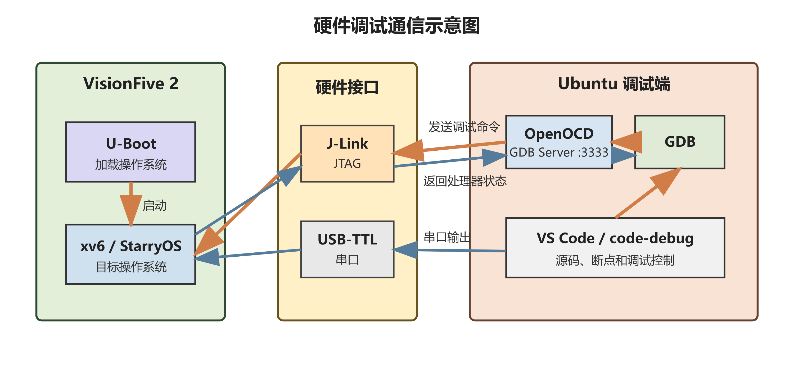
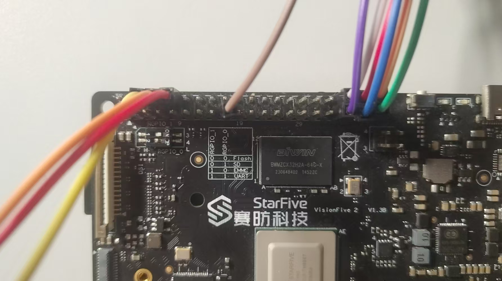
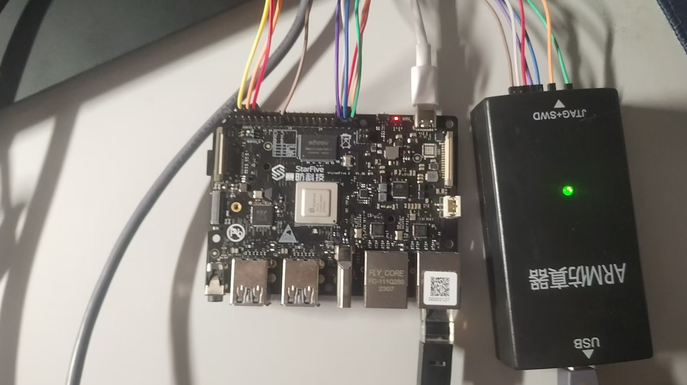
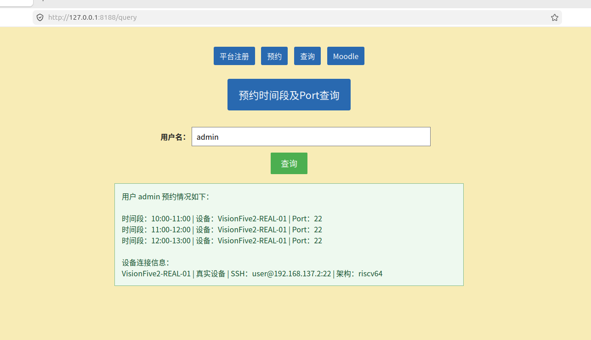
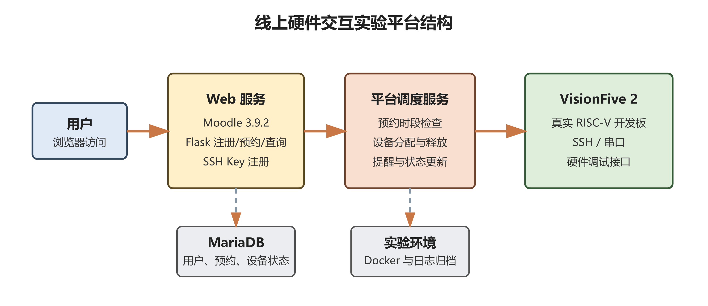

<p align="center">
  
</p>

# 操作系统跨特权级统一调试平台

## 一、项目基本信息

| 项目 | 信息 |
| --- | --- |
| 赛题 | [proj55-源代码级内核调试器](https://github.com/chenzhiy2001/code-debug) |
| 队伍名称 | 做什么都会成功队 |
| 学校 | 北京工商大学 |
| 团队成员 | 曾小红、王浩铭、武雪妍 |
| 指导教师 | 吴竞邦 |
| 初赛文档 | [操作系统跨特权级统一调试平台初赛文档](https://gitlab.eduxiji.net/T2026100119910438/project3136859-387115/-/blob/main/%E5%88%9D%E8%B5%9B%E6%96%87%E6%A1%A3-%E6%93%8D%E4%BD%9C%E7%B3%BB%E7%BB%9F%E8%B7%A8%E7%89%B9%E6%9D%83%E7%BA%A7%E7%BB%9F%E4%B8%80%E8%B0%83%E8%AF%95%E5%B9%B3%E5%8F%B0.pdf) |
| 初赛 PPT | [操作系统跨特权级统一调试平台初赛 PPT](https://gitlab.eduxiji.net/T2026100119910438/project3136859-387115/-/blob/main/%E5%88%9D%E8%B5%9BPPT-%E6%93%8D%E4%BD%9C%E7%B3%BB%E7%BB%9F%E8%B7%A8%E7%89%B9%E6%9D%83%E7%BA%A7%E7%BB%9F%E4%B8%80%E8%B0%83%E8%AF%95%E5%B9%B3%E5%8F%B0.pdf) |
| 演示材料 | [项目演示视频与调试材料](https://gitlab.eduxiji.net/T2026100119910438/project3136859-387115/-/tree/main/docs) |

## 二、项目简介

操作系统调试同时涉及内核态和用户态。两个特权级使用不同的页表、地址空间、符号表和断点集合；当 CPU 跨越特权级边界时，调试器必须同步切换调试上下文，否则断点、源码定位和调用栈都会失效。

Rust 异步操作系统又引入了第二层困难。`async` 函数被编译为由执行器反复 `poll` 的状态机，GDB 每次暂停时看到的物理调用栈只反映当前一次调用，无法直接回答“当前 Future 在等待谁”“控制流如何跨多个 poll 周期运行到这里”等问题。

本项目面向上述两类问题，构建操作系统跨特权级统一调试平台：

- 使用四状态机与断点组管理内核态、用户态之间的符号表和断点切换；
- 基于 await edge 与 call edge 还原 Rust 异步程序的逻辑执行流；
- 将异步跟踪由调试前全量预计算改为运行时按需发现；
- 在特权级切换过程中保存并恢复异步跟踪状态；
- 通过 VS Code Async Inspector 展示异步等待拓扑；
- 通过通用边界断点、动态进程组和稳定变量读取机制适配不同操作系统；
- 将调试能力扩展至 VisionFive 2 真实开发板和线上硬件实验平台。

项目代码由两个调试子系统组成：

- **osgdb**：负责操作系统跨特权级调试与断点组切换，仓库地址为 [OSDebugger/osgdb](https://github.com/OSDebugger/osgdb)。
- **async-debug（本仓库）**：负责 Rust 异步执行流跟踪、OS 调试能力融合以及 VS Code 图形化展示。

### 2.1 操作系统调试：特权级切换与符号表管理

用 GDB 调试普通用户程序时，开发者只需要加载一次符号文件，后续断点设置、变量查看和调用栈回溯都发生在同一个地址空间中。操作系统内核调试则完全不同：内核态和用户态使用不同的页表、地址空间和符号表，CPU 每跨越一次特权级边界，调试器都必须同步更换当前符号文件和断点集合。

如果由开发者手动完成这一过程，每次切换都要依次卸载旧符号、清理断点、加载新符号，再恢复目标地址空间中的断点。一个系统调用通常同时包含 user-to-kernel 和 kernel-to-user 两次切换，操作系统启动与交互过程中又会反复发生系统调用，因此手工维护既低效又容易产生断点残留、重复加载和源码定位错误。

已有工作使用四状态机驱动断点组切换，将一次跨特权级过程划分为 `kernel`、`kernel_single_step_to_user`、`user`、`user_single_step_to_kernel` 四种状态。每个断点组独立保存符号文件、普通断点、边界断点和 Hook 断点，状态机根据当前 PC、栈帧及边界断点命中情况自动完成切换。

### 2.2 Rust 异步程序调试：物理调用栈与逻辑执行流

Rust 编译器会把每个 `async` 函数转换为实现 `Future` 的状态机。状态机本身不会连续执行，而是由 executor 调用 `poll` 推进一步；遇到 `.await` 时返回 `Pending`，之后再由 executor 重新唤醒。一次完整异步调用可能跨越多个 poll 周期，传统调用栈只能看到当前周期中的函数帧。

因此，GDB 中显示的“谁调用了谁”并不等价于源码语义中的“谁在等待谁”。项目使用两种互补关系恢复逻辑执行流：

- **await edge**：通过编译器生成的 `__awaitee` 字段恢复 Future 之间的等待关系；
- **call edge**：通过运行时函数调用和返回跟踪，跨越 `block_on`、executor wrapper 等同步包装层。

两种边合并后，才能把多个 poll 周期中的离散栈帧还原为完整的异步执行因果树。


### 2.3 决赛阶段的核心问题

在前序方法基础上，决赛阶段需要解决以下四个相互关联的问题：

1. **异步跟踪开销**：将调试前解析全部 DWARF、预计算依赖树并全量插桩，改为运行时只追踪当前执行路径。
2. **跟踪状态跨特权级保持**：符号表和断点组切换时，协程实例、追踪记录和白名单配置不能随 GDB Python 环境一起丢失。
3. **调试结果可视化**：需要在 VS Code 中直接展示逻辑等待树，而不是要求开发者从大量终端文本中人工还原。
4. **调试器可移植性**：摆脱对本地源码路径、统一用户态 `ecall` 入口和静态用户进程列表的依赖，使调试器能够适配组件化操作系统。

决赛阶段还进一步将上述能力延伸至 VisionFive 2 真实开发板，并通过线上实验平台管理有限的硬件资源。

### 2.4 平台适用场景

平台面向操作系统内核开发、Rust 异步程序分析和高校实验教学三类场景。对于内核开发者，调试器自动维护特权级对应的符号表和断点集合；对于异步程序开发者，逻辑调用树补充传统调用栈无法表达的等待关系；对于实验教学，线上平台把共享开发板的使用过程纳入预约和会话管理。三个场景共享同一套 GDB/MI2 协议层和调试状态模型，使功能不是彼此独立的演示模块，而是可以在同一调试流程中组合使用。

## 三、总体方案与完成情况

决赛阶段工作围绕四个核心技术问题展开，并进一步完成真实硬件与线上实验环境扩展。

| 技术项 | 状态 | 主要结果 |
| --- | :---: | --- |
| 运行时按需发现机制 | 完成 | 去除 DWARF 预解析和全量插桩；运行时读取 `__awaitee` 动态发现等待关系 |
| 协程实例级识别 | 完成 | 使用 `(poll_symbol, env_ptr)` 二元组区分同一异步函数的并发实例，并分配稳定 CID |
| Trace Root 与白名单动态管理 | 完成 | 支持手动指定或从 backtrace 推断追踪根节点；白名单按 crate 分组并支持运行时更新 |
| OS 调试能力融合 | 完成 | 将四状态机、断点组和 Border/Hook 断点机制移植到 async-debug |
| Save/Restore 跟踪状态保持 | 完成 | 保存断点、协程状态、追踪记录和白名单配置，按五步顺序恢复 |
| VS Code 插件化与 Async Inspector | 完成 | 实现 Debug Adapter、Extension、Webview 三层架构和异步逻辑调用树 |
| 面向不同 OS 的通用化改进 | 完成 | 实现函数名断点、通用 syscall 收敛点、方向属性、动态进程组自动注入和跨 Rust 版本变量读取 |
| 自动化测试 | 完成 | 37 个 OSStateMachine 单元测试和 4 个 MockMI2 集成测试全部通过 |
| 实际目标验证 | 完成 | 完成 embassy、StarryOS 和 Async-os 三类场景验证 |
| VisionFive 2 真机调试 | 完成 | 建立 J-Link、OpenOCD、GDB 与串口链路，完成处理器状态读取、暂停、恢复及跨特权级调试适配 |
| 线上硬件交互平台 | 完成 | 实现真实开发板预约、分配、释放、SSH 公钥注册、状态更新、日志和会话归档 |


### 3.1 文档索引

- [一、项目基本信息](#一项目基本信息)
- [二、项目简介](#二项目简介)
  - [2.1 操作系统调试：特权级切换与符号表管理](#21-操作系统调试特权级切换与符号表管理)
  - [2.2 Rust 异步程序调试：物理调用栈与逻辑执行流](#22-rust-异步程序调试物理调用栈与逻辑执行流)
  - [2.3 决赛阶段的核心问题](#23-决赛阶段的核心问题)
- [三、总体方案与完成情况](#三总体方案与完成情况)
- [四、核心工作](#四核心工作)
  - [4.1 从静态预计算到运行时按需发现](#41-从静态预计算到运行时按需发现)
  - [4.2 异步跟踪状态跨特权级保存与恢复](#42-异步跟踪状态跨特权级保存与恢复)
  - [4.3 Async Inspector 图形化调试界面](#43-async-inspector-图形化调试界面)
  - [4.4 面向不同操作系统的通用化改进](#44-面向不同操作系统的通用化改进)
  - [4.5 VisionFive 2 真机调试与线上化扩展](#45-visionfive-2-真机调试与线上化扩展)
- [五、测试与验证](#五测试与验证)
  - [5.1 状态机单元测试与集成测试](#51-状态机单元测试与集成测试)
  - [5.2 embassy 异步跟踪验证](#52-embassy-异步跟踪验证)
  - [5.3 StarryOS 跨特权级调试验证](#53-starryos-跨特权级调试验证)
  - [5.4 Async-os 统一调试验证](#54-async-os-统一调试验证)
- [六、使用与运行](#六使用与运行)
- [七、项目结构](#七项目结构)
- [八、演示与文档](#八演示与文档)
- [九、项目分工](#九项目分工)
- [十、总结与展望](#十总结与展望)
- [十一、参考项目与资料](#十一参考项目与资料)

## 四、核心工作

### 4.1 从静态预计算到运行时按需发现

#### 4.1.1 原有方案的开销与实例混淆

已有异步跟踪方法需要在调试开始前离线解析完整 DWARF 信息、预计算依赖树，并为所有候选函数设置跟踪断点。该方案的准备开销随程序规模增长，而且使用类型偏移量识别协程时，无法区分同一异步函数的多个并发实例。

本项目改为运行时按需发现：调试器从当前 trace root 出发，仅在实际执行路径上读取编译器生成的 `__awaitee` 字段，发现真正被等待的子 Future；遇到同步包装层时，通过 call edge 跟踪真实函数调用，从而把异步等待关系与机器级控制流连接起来。

具体机制包括：

1. 设置 trace root，并为其安装 poll 入口断点；
2. 断点命中后读取 `__awaitee`，按需发现子 Future；
3. 使用 `(poll_symbol, env_ptr)` 作为实例键，为并发协程分配稳定 CID；
4. 通过轻量影子栈维护动态调用关系，并在函数返回时自动弹栈；
5. 将 await edge 与 call edge 合并，生成可供界面展示的逻辑调用树快照。

这一改进使跟踪成本由“与整个程序规模相关”变为“与当前实际执行路径相关”，同时解决了同一异步函数多实例混淆问题。

#### 4.1.2 `__awaitee` 驱动的等待关系发现

当某个协程 poll 入口断点命中时，GDB Python 脚本读取当前帧中的 Future 环境对象，并检查其 `__awaitee` 字段。如果字段指向新的子 Future，调试器立即记录一条 await edge，并为新目标安装最少量的跟踪断点。未出现在当前等待链上的函数不会被提前插桩。

这种方法把发现过程从“调试开始前”移动到“程序实际运行时”。它不需要为所有潜在函数构建完整静态依赖树，也不需要等待全量 DWARF 解析完成，因此程序规模增大时，启动成本不会按照候选异步函数数量同步增长。

#### 4.1.3 `(poll_symbol, env_ptr)` 实例标识与 CID

只使用函数名或 DWARF 类型偏移量无法区分同一异步函数的多个实例。例如网络服务同时处理多个连接时，每个连接可能执行同一个 `handle_connection` Future，但它们拥有不同的状态和等待对象。

项目以 poll 函数符号与 Future 环境对象地址组成二元键 `(poll_symbol, env_ptr)`。首次观察到该键时分配一个 CID，此后同一实例跨多个 poll 周期都使用相同 CID。逻辑调用树因此能够分别统计每个实例的 poll 次数、返回次数和活跃状态，而不会把并发任务错误合并。

#### 4.1.4 Trace Root、白名单与动态 call edge

用户可以显式指定 trace root，也可以由调试器从当前 backtrace 中推断。白名单按 crate 分组管理，用于限制需要追踪的用户代码范围；运行期间可以重新生成、编辑并应用白名单，不必重启调试会话。

当 await edge 遇到同步包装函数而中断时，调试器根据当前指令和符号信息识别真实 call-site，在被调用函数入口安装内部跟踪断点，并在返回地址安装 PopOnReturnBP。轻量影子栈随函数进入和退出更新，从而恢复跨越同步边界的 call edge。

### 4.2 异步跟踪状态跨特权级保存与恢复

#### 4.2.1 状态丢失的具体原因

当调试器从内核态切换到用户态时，需要卸载内核符号表、替换断点组并加载用户程序符号。若直接沿用传统切换流程，异步跟踪积累的协程实例、跟踪断点、调用关系和白名单地址都会丢失。

为此，项目设计跨生命周期的 Save/Restore 机制。切换前统一保存四类数据：

- 调试器断点及其逻辑角色；
- 协程 CID、poll 次数、活跃状态和实例映射；
- trace root、await edge、call edge 与影子栈等追踪记录；
- 白名单函数及其在当前符号表中的地址映射。

切换符号文件后，调试器依次恢复白名单、追踪记录和协程状态，清理残余旧断点，最后重建动态跟踪断点，保证跨地址空间的异步追踪连续性。

#### 4.2.2 切换前保存的四类数据

保存对象不仅包括用户在编辑器中设置的源码断点，还包括调试器运行时自动产生的内部状态。项目将其划分为四类共 19 项数据：普通断点和跟踪断点；CID 映射、协程状态与 poll 统计；trace root、活动路径、await/call edge 和影子栈；白名单函数名称、分组结果及地址映射。

保存时必须区分“用户期望长期存在的逻辑断点”和“仅在当前符号空间有效的 GDB 断点编号”。后者不能直接复制到新地址空间，只能在重新加载符号后根据逻辑描述重建。

#### 4.2.3 五步有序恢复

恢复顺序不能任意调整：白名单地址依赖新的符号表，动态跟踪断点又依赖已恢复的协程实例与调用路径。如果先恢复断点、后恢复状态，就可能产生无归属断点或使用旧地址。

因此调试器依次完成：根据新符号表恢复白名单；恢复追踪记录；恢复 CID 与协程状态；清理残余旧断点；根据活动追踪路径重建内部断点。普通源码断点和 OS 特殊断点由断点组切换流程另行恢复。该顺序保证界面中的逻辑调用树在一次特权级切换前后连续，而不是被重置成新的调试会话。

### 4.3 Async Inspector 图形化调试界面

#### 4.3.1 三层插件架构

命令行文本难以呈现包含大量协程的异步依赖关系，而 VS Code 原生 Call Stack 只理解线程和物理栈帧。项目因此实现 Async Inspector Webview 面板，与原生调用栈形成“物理流 + 逻辑流”双轨调试模式。

界面采用三层架构：

- **数据层**：GDB Python 脚本生成包含 await edge、call edge、CID、poll 次数和状态的 JSON 快照；
- **传输层**：Debug Adapter 与 Extension 监听 stopped 事件，并通过消息通道传递快照；
- **展示层**：Webview 将快照渲染为可交互的多根逻辑调用树。

面板按颜色区分 async 协程与 sync 函数，节点显示 CID、poll 次数和活跃状态，并支持点击节点跳转源码。白名单的 Gen、Apply、Trace 操作也被集成到同一工作流中。

#### 4.3.2 界面语义与交互流程

Async Inspector 不是对 Call Stack 的简单复制。Call Stack 展示“当前一次暂停时机器栈上有哪些帧”，Async Inspector 展示“跨多个 poll 周期之后，哪些协程正在等待哪些子任务”。前者适合查看局部控制流和变量，后者适合理解异步任务之间的长期依赖。

面板中的每个节点包含三类信息：函数名称及源码位置；CID、poll 次数、返回次数和活动状态等协程元数据；await edge 或 call edge 对应的父子关系。开发者点击节点后可以跳转源码，在逻辑视图和传统单步调试之间快速切换。

典型工作流为：启动调试会话并暂停；打开 Async Inspector；点击 Gen Whitelist 扫描 ELF 符号并按 crate 生成候选函数；选择用户 crate 后 Apply Whitelist；选定函数并执行 Trace；程序再次暂停时，由 `DebugAdapterTracker` 监听 stopped 事件并自动刷新快照。

#### 4.3.3 物理流与逻辑流双轨协同

原生 VS Code 面板继续负责断点、单步、变量和物理调用栈，Async Inspector 只在调试器停止时获取当前异步拓扑。两套视图共享同一 GDB 会话，不会额外启动调试后端。开发者可以先在 Call Stack 判断当前停在哪个实际栈帧，再到 Async Inspector 中查看该帧所属协程位于整棵等待树的什么位置。


### 4.4 面向不同操作系统的通用化改进

教学 OS 上的调试机制通常隐含三个前提：内核与用户源码处于同一工作区、所有系统调用具有统一的用户态入口、用户程序能够在调试开始前静态配置。基于 ArceOS 框架的组件化 OS StarryOS 不满足这些前提，因此项目完成了三组改进。


#### 4.4.1 边界断点定位与方向识别

- 使用函数名断点定位外部 crate 中的特权级切换函数，摆脱本地源码路径和行号依赖；
- 将 user-to-kernel 边界收敛到内核唯一的 syscall handler，以一个断点覆盖所有用户态系统调用入口；
- 为边界断点增加 `kernel_to_user` 和 `user_to_kernel` 方向属性，区分同处内核地址空间的两类边界。

原有边界断点只能通过文件路径和行号指定。当 `enter_user` 位于外部 crate 中时，源码缓存目录会随操作系统、依赖版本和开发者环境改变，配置无法直接迁移。函数名断点只依赖已经加载到 ELF 的符号，因此能够定位工作区外的切换函数。

组件化 OS 的用户程序通过 libc 中大量独立封装函数执行 `ecall`，用户态不存在唯一入口。但所有系统调用陷入内核后都必须进入同一个分发函数，例如 StarryOS 的 `starry_kernel::syscall::handle_syscall`。将 user-to-kernel 边界移动到该通用收敛点，只需一个函数名断点即可覆盖所有系统调用。

两个方向的边界由此都可能位于内核地址空间，单靠 PC 范围无法判断方向。`direction` 属性把断点位置与状态机允许的转换方向绑定：只有方向和当前状态同时匹配，断点才被视为有效边界。


#### 4.4.2 跨 Rust 版本变量读取

Hook 断点需要读取 Rust `String` 参数，但其内部字段布局会随编译器版本变化。项目利用 GDB/MI console 输出与 result record 的严格顺序关系，在协议层捕获 GDB pretty printer 输出，再通过内存直读和字节重构得到字符串内容，避免依赖任何固定字段路径。

具体流程为：向 GDB 发送带 token 的 console 命令；收集该 token 对应 result record 返回前产生的全部 console 输出；从 pretty printer 结果中解析数据指针和长度；使用 `data-read-memory-bytes` 读取目标内存；最后按 UTF-8 解码。GDB 负责适配编译器数据布局，调试器只处理稳定的显示结果和原始字节，因此不需要维护 Rust 版本字段路径表。

#### 4.4.3 动态进程组自动注入

组件化 OS 的用户程序在运行时通过 `execve` 动态出现。项目维护 user-to-kernel 边界断点待注入队列；无论进程组何时创建，都自动继承返回内核态所需的边界断点，使多次特权级切换链路保持闭合。

Hook 断点命中 `execve` 后读取程序路径，生成断点组名称并加载相应用户 ELF。新组创建完成时，`updateCurrentBreakpointGroup` 与 `saveBreakpointsToBreakpointGroup` 两条创建路径都会执行相同的注入逻辑，避免只覆盖某一种创建时机。新程序第一次运行之前就拥有返回内核态的边界断点，无需预先枚举所有用户应用。

### 4.5 VisionFive 2 真机调试与线上化扩展

#### 4.5.1 硬件调试通信链路

项目在已有工作的基础上完成 VisionFive 2 硬件调试适配。GDB 负责加载符号和发送调试命令，OpenOCD 在 3333 端口提供 GDB Server，J-Link 通过 JTAG 控制处理器，USB-TTL 串口用于观察 U-Boot 和目标系统输出。

调试环境采用 J-Link V12 与 OpenOCD 0.12.0，JTAG 扫描得到 TAP ID `0x07110cfd`，可识别 E24、U74 调试模块以及 5 个 XLEN=64 的 hart，并支持查看线程状态、读取 PC/SP/RA、暂停和恢复处理器。针对真实硬件单步期间 `dcsr.stepie=0` 且无法通过 OpenOCD 改写相关 CSR 的限制，采用边界断点和断点组切换完成内核态、用户态单步及跨特权级双向切换。



JTAG 与串口承担不同职责：J-Link 连接 TMS、TRST、TCK、TDI、TDO、GND 和目标参考电压，用于控制处理器；USB-TTL 只连接 GND、RXD 和 TXD，采用 115200 bit/s、8 数据位、1 停止位、无流控，用于输出日志，不向开发板供电。处理器因调试请求暂停时，板载网络和 SSH 也会暂时停止；恢复处理器后服务继续运行，因此结束调试会话时必须显式执行恢复操作。

| USB-TTL 串口连接 | VisionFive 2 完整调试连接 |
| :---: | :---: |
|  |  |

真实硬件的 `dcsr.stepie` 字段为 0，单步期间中断关闭，同时开发板调试模块不允许使用 OpenOCD `set_reg` 改写相关 CSR。项目利用跳板页在内核态和用户态地址一致的特点，将边界断点放在 `ecall` 之前，在页表变化前保存用户态断点组，进入内核后加载内核组；返回用户态时再执行反向恢复。

#### 4.5.2 线上硬件交互平台

项目同时实现线上硬件交互实验平台：Moodle 提供教学入口，Flask 提供注册、预约与查询接口，MariaDB 保存用户、预约、设备和调度状态，Docker 提供隔离实验环境，SSH、TFTP 和 RISC-V 工具链承担设备访问、文件传输与编译任务。平台已完成真实 VisionFive 2 的预约、分配、释放、提前提醒、状态更新、终端日志和实验会话归档。

用户注册 SSH 公钥后，可以预约具体实验时段并查询设备分配结果。预约开始时，调度器把真实 VisionFive 2 分配给当前用户并更新设备状态；预约结束时，平台停止当前会话、归档终端日志、释放设备并把状态恢复为 idle。查询页面会显示当前会话的 SSH 连接信息、`riscv64` 架构和 Debian 系统信息。



#### 4.5.3 调试链路与预约系统结合

目前真实开发板预约调度和 J-Link/OpenOCD/GDB/串口调试链路已经分别建立。结合后的会话模型是：预约生效后同时授予板卡和调试资源使用权，向用户返回 GDB 连接信息和串口会话；结束时停止 OpenOCD/GDB 会话、恢复处理器、归档串口输出并释放设备。后续工作将把这些步骤从人工操作进一步纳入调度器自动编排。



## 五、测试与验证

### 5.1 状态机单元测试与集成测试

#### 5.1.1 OSStateMachine 单元测试

项目编写 37 个 OSStateMachine 单元测试，覆盖四状态机合法转换、Border/Hook 断点、方向属性、连续单步和异常路径。`testOSDebugFlow.ts` 使用 MockMI2 模拟 GDB 后端，验证以下四类完整场景：

1. 内核启动后首次进入用户态；
2. Hook 断点发现新程序并动态创建进程组；
3. 用户态进入内核态时通过函数名边界断点走 PC 快速路径；
4. 连续三次 kernel-to-user-to-kernel 切换中，符号文件、断点和异步状态均正确保持。

37 个单元测试和 4 个集成测试场景全部通过。

单元测试使用 MockMI2 提供可控 PC、栈帧、寄存器值和断点编号，不依赖 VS Code、QEMU 或真实 GDB。测试覆盖四状态机所有合法路径、方向属性判断、断点组未就绪、符号加载失败、异步断点编号返回超时等边界条件。

#### 5.1.2 完整调试流程集成测试

四个集成场景从 `doAction` 和 `stateTransition` 层面验证完整链路，而不是只测试单个函数：内核首次进入用户态；`execve` Hook 发现新程序并创建动态进程组；系统调用进入内核时通过函数名匹配走 PC 快速路径；连续三轮双向切换后检查符号加载次数、断点残留和异步状态恢复结果。

### 5.2 embassy 异步跟踪验证

embassy 使用自定义 executor，不依赖 Tokio 等外部异步运行时。工具在 embassy `tick` 示例上恢复出 `main_task -> run_task -> timer::poll` 三层等待链，正确统计 poll 次数、返回次数和活跃状态，证明跟踪能力只依赖编译器生成的标准状态机结构与调试信息，而不依赖特定运行时内部实现。

验证流程包括：以调试模式编译示例并保留完整 DWARF；在 `launch.json` 中启用异步调试；生成按 crate 分组的白名单；选中用户 crate 后设置 trace root；继续运行直至下一个停止事件，由 Async Inspector 自动刷新逻辑调用树。

结果显示最外层 `main_task`、中间的 `run_task` 和最内层 `timer::poll` 形成三层嵌套等待链。最外层任务完成后标记为 inactive，计时器未到期时内层 Future 多次返回 Pending，poll 次数持续累计，与计时器驱动的真实执行特征一致。

本次输出中，`main_task` 的 `calls=1、exit=1、active=no`，`run_task` 的 `calls=3、exit=1、active=yes`，`timer::poll` 的 `calls=3、exit=2、active=yes`。这些实例级统计与计时器尚未到期、内层 Future 多次返回 Pending 的行为一致。


### 5.3 StarryOS 跨特权级调试验证

项目在组件化 Rust 操作系统 StarryOS 上完成从内核启动、进入 shell、动态加载用户程序到多次系统调用往返的完整调试流程。函数名边界断点、syscall handler 收敛点、方向属性、跨 Rust 版本路径读取和动态进程组注入均在真实流程中得到验证。整个过程中无需人工卸载符号表或重建断点组。

调试配置通过 `enter_user` 指定 kernel-to-user 边界，通过完整 Rust 符号 `starry_kernel::syscall::handle_syscall` 指定 user-to-kernel 边界。两者虽然都位于内核地址空间，但状态机能够依靠方向字段准确识别。

当 shell 启动用户程序时，Hook 断点在 `execve` 中命中，`getStringVariable('path')` 读取程序路径并映射到用户源码和 ELF；调试器创建断点组、注入 user-to-kernel 边界、加载用户符号并继续执行。用户程序随后发起系统调用时，状态机再次自动切回 kernel 组。

典型配置片段如下：

```json
{
  "version": "0.2.0",
  "configurations": [{
    "type": "ardb",
    "request": "attach",
    "name": "StarryOS Debug (riscv64)",
    "cwd": "${workspaceFolder}",
    "target": ":1234",
    "gdbpath": "/opt/riscv/bin/riscv64-unknown-elf-gdb",
    "executable": "${workspaceFolder}/target/riscv64gc-unknown-none-elf/release/starryos",
    "qemuPath": "qemu-system-riscv64",
    "qemuArgs": [
      "-L", "/usr/share/qemu", "-m", "1G", "-smp", "1",
      "-machine", "virt", "-bios", "default",
      "-kernel", "${workspaceFolder}/StarryOS_riscv64-qemu-virt.bin",
      "-nographic", "-s", "-S"
    ],
    "first_breakpoint_group": "kernel",
    "stopAtConnect": true,
    "program_counter_id": 32,
    "kernel_memory_ranges": [
      ["0xffffffc000000000", "0xffffffffffffffff"]
    ],
    "user_memory_ranges": [
      ["0x0000000000001000", "0x0000004000000000"]
    ],
    "border_breakpoints": [
      {
        "function": "enter_user",
        "direction": "kernel_to_user"
      },
      {
        "function": "starry_kernel::syscall::handle_syscall",
        "direction": "user_to_kernel"
      }
    ],
    "hook_breakpoints": [{
      "breakpoint": {
        "file": "${workspaceFolder}/kernel/src/syscall/task/execve.rs",
        "line": 65
      },
      "behavior": {
        "functionArguments": "",
        "functionBody": "const p = await this.getStringVariable('path'); const name = p.replace('./','').split('/').pop(); return '${workspaceFolder}/user_apps/' + name + '.c';",
        "isAsync": true
      }
    }],
    "filePathToBreakpointGroupNames": {
      "isAsync": false,
      "functionArguments": "filePathStr",
      "functionBody": "if (filePathStr.includes('kernel/src')) { return ['kernel']; } else { return [filePathStr]; }"
    },
    "breakpointGroupNameToDebugFilePaths": {
      "isAsync": false,
      "functionArguments": "groupName",
      "functionBody": "if (groupName === 'kernel') { return ['${workspaceFolder}/target/riscv64gc-unknown-none-elf/release/starryos']; } else { return [groupName.replace('.c', '')]; }"
    }
  }]
}
```

该配置同时给出了 QEMU/GDB 连接、内核与用户地址范围、双向边界断点、`execve` Hook，以及“源码路径 - 断点组 - 符号文件”两组可编程映射。实际部署时只需按本机工具链、镜像和用户程序目录调整路径，不应照搬示例中的环境路径。

当前仓库在 `package.json` 中注册的调试类型为 `ardb`；旧版 osgdb 配置中曾使用 `osdb`，复制旧配置时需要同步改为当前类型。

完整调试流程为：QEMU 以 `-s -S` 启动并等待 GDB；调试器加载内核符号并进入 kernel 断点组；命中 `enter_user` 后切换到用户态；StarryOS 进入 shell；用户命令触发 `execve` Hook，调试器读取路径、创建进程组并加载用户 ELF；用户程序执行 `ecall` 后在 syscall handler 收敛点切回 kernel 组；系统调用返回时再切回对应用户组。多轮往返过程中，源码断点、符号文件和异步跟踪状态均由状态机自动维护。

### 5.4 Async-os 统一调试验证

在 rel4 异步操作系统上同时启用 OS 调试与异步跟踪后，调试器实现：

- 内核态与用户态之间断点组、符号表自动切换；
- 特权级切换前后 CID、poll 次数、trace root 和 await/call edge 连续保持；
- Async Inspector 展示跨内核态和用户态的逻辑调用树。

该结果验证了跨特权级切换管理和异步执行流还原能够在统一平台中协同工作。

Async-os 场景同时启用 `osDebug` 和 `asyncDebug`。状态机负责在地址空间变化时触发 Save/Restore，异步脚本负责继续维护 trace root 和逻辑调用图。验证过程中，用户程序发起异步 I/O 并跨越系统调用边界后，内核态和用户态中的 Future 仍能通过 await edge 正确关联，证明两套机制不是简单并列，而是能够共享一次调试会话。

## 六、使用与运行

### 6.1 构建 VS Code 调试扩展

```bash
npm install
npm run compile
```

在 VS Code 中打开本仓库，按 `F5` 启动 Extension Development Host。根据被调试系统填写 `.vscode/launch.json`，配置 GDB 路径、远程调试端口、内核与用户地址范围、符号文件以及边界断点。

### 6.2 运行自动化测试

```bash
npm run compile
node out/test/testOSStateMachine.js
node out/test/testOSDebugFlow.js
```

其中 `testOSStateMachine.js` 覆盖 37 个状态机单元测试，`testOSDebugFlow.js` 通过 MockMI2 执行 4 个完整调试流程场景。仓库当前未定义 `npm test` 脚本，因此应先编译 TypeScript，再直接运行生成的测试文件。

### 6.3 基本调试流程

1. 启动 QEMU GDB Server 或真实开发板 OpenOCD GDB Server；
2. 在 VS Code 中启动调试配置；
3. 按需打开 Async Inspector；
4. 生成并应用白名单，选择 trace root；
5. 在内核态和用户态源码设置普通断点，继续或单步执行；
6. 由状态机自动完成特权级切换、符号表加载和断点组恢复。

## 七、项目结构

```text
.
├── src/                    # VS Code Extension、Debug Adapter 与 MI2 协议层
├── async_rust_debugger/    # GDB Python 异步跟踪脚本
├── src/test/               # 状态机与 MockMI2 集成测试
├── testcases/              # Rust 异步跟踪示例程序
├── docs/                   # 演示视频、进度文档与图片资源
├── .vscode/                # 扩展调试配置
├── package.json
└── README.md
```

## 八、演示与文档

### 8.1 演示视频

- [async-debug 调试演示视频](https://gitlab.eduxiji.net/T2026100119910438/project3136859-387115/-/blob/main/docs/async-debug_%E8%B0%83%E8%AF%95%E6%BC%94%E7%A4%BA.mp4)
- [osgdb StarryOS 调试视频](https://gitlab.eduxiji.net/T2026100119910438/project3136859-387115/-/blob/main/docs/osgdb_StarryOS%E8%B0%83%E8%AF%95%E6%BC%94%E7%A4%BA.mp4)
- [async-debug embassy 调试演示视频](https://gitlab.eduxiji.net/T2026100119910438/project3136859-387115/-/blob/main/docs/embassy%E8%B0%83%E8%AF%95%E6%BC%94%E7%A4%BA.mp4)
- [Async-os 调试演示视频](https://gitlab.eduxiji.net/T2026100119910438/project3136859-387115/-/blob/main/docs/rel4%E5%BC%82%E6%AD%A5%E6%93%8D%E4%BD%9C%E7%B3%BB%E7%BB%9F%E8%B0%83%E8%AF%95%E6%BC%94%E7%A4%BA.mp4)

### 8.2 项目文档

- [操作系统跨特权级统一调试平台初赛文档](https://gitlab.eduxiji.net/T2026100119910438/project3136859-387115/-/blob/main/%E5%88%9D%E8%B5%9B%E6%96%87%E6%A1%A3-%E6%93%8D%E4%BD%9C%E7%B3%BB%E7%BB%9F%E8%B7%A8%E7%89%B9%E6%9D%83%E7%BA%A7%E7%BB%9F%E4%B8%80%E8%B0%83%E8%AF%95%E5%B9%B3%E5%8F%B0.pdf)
- [操作系统跨特权级统一调试平台初赛 PPT](https://gitlab.eduxiji.net/T2026100119910438/project3136859-387115/-/blob/main/%E5%88%9D%E8%B5%9BPPT-%E6%93%8D%E4%BD%9C%E7%B3%BB%E7%BB%9F%E8%B7%A8%E7%89%B9%E6%9D%83%E7%BA%A7%E7%BB%9F%E4%B8%80%E8%B0%83%E8%AF%95%E5%B9%B3%E5%8F%B0.pdf)

## 九、项目分工

| 成员 | 主要分工 |
| --- | --- |
| 曾小红 | 异步跟踪方案改进；异步跟踪与 OS 调试融合；Async Inspector 设计与实现；StarryOS、embassy 与 Async-os 适配验证；参赛文档和 PPT 制作 |
| 王浩铭 | OS 调试功能测试与验证（状态机单元测试、集成测试）；VisionFive 2 硬件调试与线上实验平台扩展 |
| 武雪妍 | 文档图片与示意图制作；参赛 PPT 制作 |

## 十、总结与展望

### 10.1 已完成工作总结

本项目在已有操作系统跨特权级调试与异步跟踪方法的基础上，完成了从算法机制、工程实现、图形界面到真实硬件实验环境的一系列扩展。

1. **降低异步跟踪启动开销**。移除调试前完整 DWARF 解析和全量断点部署，改为运行时通过 `__awaitee` 按需发现等待关系；使用 `(poll_symbol, env_ptr)` 区分并发实例，使成本主要取决于实际执行路径而不是程序总体规模。
2. **实现异步跟踪与 OS 调试融合**。把四状态机和断点组机制移植到 async-debug，并设计四类数据保存、五步有序恢复流程，使协程状态、跟踪记录和白名单能够跨越内核态、用户态地址空间切换。
3. **完成图形化调试器扩展**。构建 Debug Adapter、Extension、Webview 三层架构，以 Async Inspector 展示 await edge 与 call edge 组成的逻辑调用树，与 VS Code 原生 Call Stack 形成物理流和逻辑流双轨协同。
4. **提高跨操作系统可移植性**。通过函数名边界断点、内核 syscall handler 通用收敛点、方向属性、GDB pretty printer 驱动的变量读取和动态进程组自动注入，摆脱教学 OS 的静态源码结构假设。
5. **建立完整验证体系**。37 个状态机单元测试和 4 个集成场景全部通过；embassy 证明异步跟踪不依赖特定运行时；StarryOS 验证组件化 OS 适配；Async-os 验证跨特权级切换与异步执行流还原的协同工作。
6. **扩展真实硬件和线上实验能力**。建立 VisionFive 2、J-Link、OpenOCD、GDB 和串口链路，并将真实开发板接入具备预约、调度、状态管理、日志归档能力的线上硬件交互平台。

### 10.2 进一步改进方向

统一调试平台的核心功能已经建立，但配置易用性、特权级切换性能和硬件调试服务编排仍有提升空间。配置自动推导将减少新操作系统适配时的人工工作；切换性能优化将改善交互式 shell 场景；线上平台与 OpenOCD、GDB、串口服务的进一步融合，则可以把已经验证的单机真机调试过程转换为面向多用户的预约式远程实验服务。

1. 解析内核 ELF 与链接脚本，自动推导地址范围、syscall handler 和内核出口函数等调试配置；
2. 使用 GDB `finish` 和切换冷却机制优化 kernel-to-user 方向逐指令单步的性能；
3. 将 OpenOCD 进程启停、GDB 连接信息和串口日志纳入预约调度，形成完整的远程硬件调试会话。

## 十一、参考项目与资料

- [code-debug（2023-2024）](https://github.com/chenzhiy2001/code-debug)：四状态机与断点组管理机制。
- [ARDB（2025）](https://github.com/OSDebugger/code-debug_Asynchronous-trace)：await edge 与 call edge 双关系恢复方法。
- [StarryOS](https://github.com/Starry-OS/StarryOS)：组件化 Rust 操作系统验证目标。
- [rCore-Tutorial-v3](https://github.com/rcore-os/rCore-Tutorial-v3)：教学操作系统。
- [embassy](https://github.com/embassy-rs/embassy)：嵌入式异步框架验证目标。
- [rel4_kernel](https://github.com/rel4team/rel4_kernel)：Async-os 统一调试验证目标。
- [GDB/MI 协议文档](https://sourceware.org/gdb/current/onlinedocs/gdb.html/GDB_002fMI.html)
- [Debug Adapter Protocol](https://microsoft.github.io/debug-adapter-protocol/)
