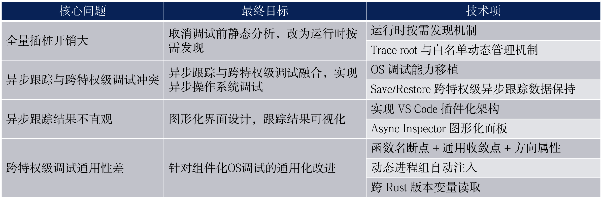
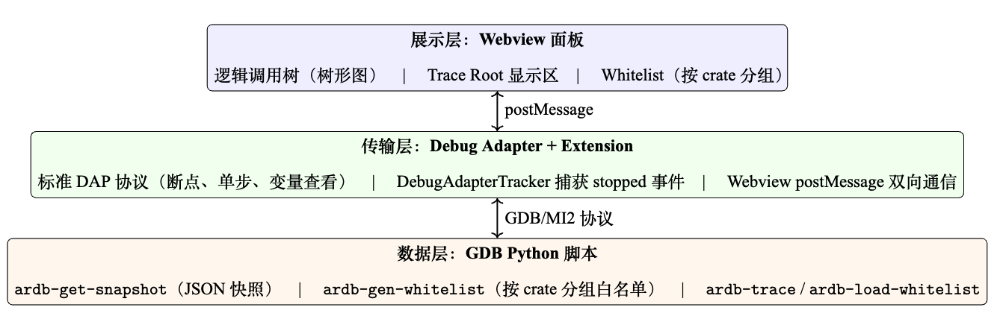
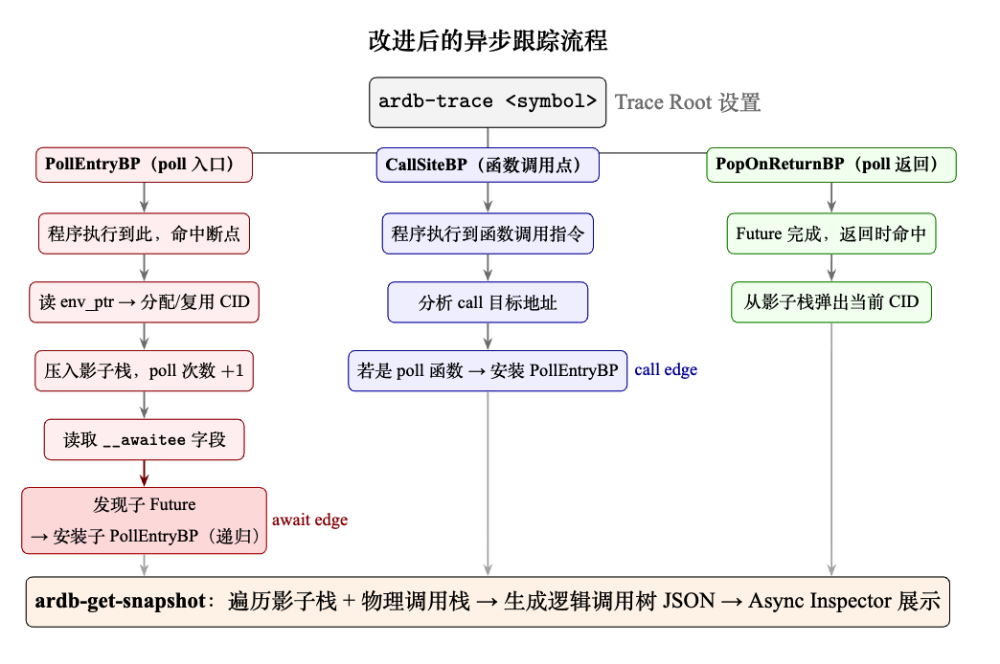
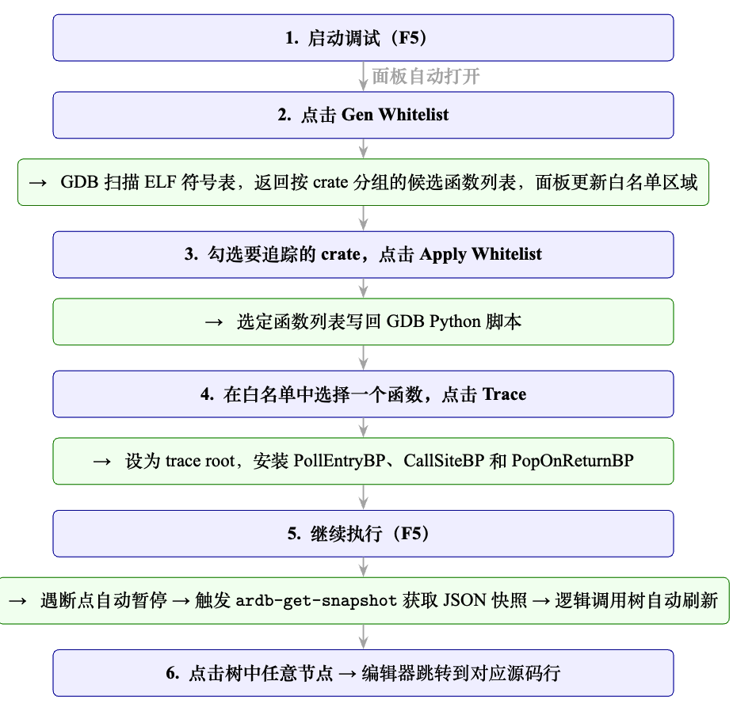
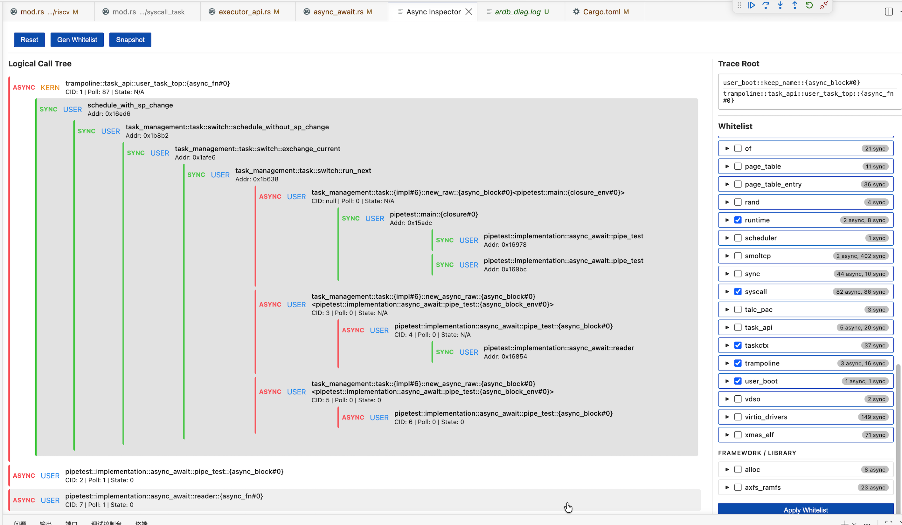

  

# 源代码级异步操作系统调试方法

## 一、基本信息

### 1.1 项目信息

| **赛题**     | [proj55-源代码级内核调试器](https://github.com/chenzhiy2001/code-debug) |
| ------------ | ------------------------------------------------------------ |
| **队伍名称** | 做什么都会成功队                                             |
| **学校**     | 北京工商大学                                                 |
| **小组成员** | 曾小红、王浩铭、武雪妍                                       |
| **指导老师** | 吴竞邦                                                       |
| **决赛文档** | [源代码级异步操作系统调试方法决赛文档](决赛文档-源代码级异步操作系统调试方法.pdf)                                                      |
| **决赛PPT** | [源代码级异步操作系统调试方法决赛PPT](决赛PPT（PDF版）-源代码级异步操作系统调试方法.pdf)                                                       |
| **演示视频** | [源代码级异步操作系统调试方法决赛演示视频](docs)                                                      |
| **开发进度** | [开发进度](docs/开发进度.md)                                                      |

### 1.2 摘要

调试操作系统内核的难点在于，内核态和用户态使用完全不同的符号表与断点集合，每次特权级切换都需要调试器手动干预。当操作系统本身采用 Rust 异步编程模型时，async 函数的物理调用栈与逻辑执行流之间还存在第二层断裂——开发者即使看到了栈帧，也难以理解「当前在等待谁、为什么会执行到这里」。

本项目围绕四个核心问题展开：

- **异步跟踪开销问题**：去掉调试前的静态 DWARF 预解析，改为运行时通过 `__awaitee` 字段按需发现等待关系，引入 `(poll_sym, env_ptr)` 实例级识别和 trace root 概念。
- **异步跟踪与跨特权级调试的融合**：设计跨生命周期的 save/restore 机制维护四类共 19 项数据的连续性，白名单随断点组分组管理、物理栈回退保证任意停止位置树不为空、以内核锚点让一棵调用树贯穿两个特权级，实现异步操作系统调试。
- **图形化界面设计**：实现 VS Code 插件化三层架构，Async Inspector 面板以树形图承载等待拓扑、协程元数据和节点身份三类异步语义，与原生 Call Stack 形成双轨协同。
- **调试器通用性改进**：通过函数名断点、通用收敛点+方向属性、动态进程组自动注入、跨 Rust 版本变量读取等技术，使调试器从教学 OS 扩展到组件化 OS，并适配 Rust 异步操作系统。

### 1.3 完成情况

项目代码分布在两个仓库中：
- **osgdb**：涉及特权级切换的源代码级 OS 调试工具。GitHub 地址：[https://github.com/OSDebugger/osgdb](https://github.com/OSDebugger/osgdb)
- **async-debug**：支持跨特权级的 Rust 异步跟踪工具。GitHub 地址：[https://github.com/OSDebugger/async-debug](https://github.com/OSDebugger/async-debug)

| 核心问题 | 最终目标 | 完成情况 | 说明 |
| :--- | :--- | :------: | :--- |
| 全量插桩开销大 | 运行时按需发现 | **全部完成** | 去掉 DWARF 预解析，运行时读取 `__awaitee` 字段动态发现；`(poll_sym, env_ptr)` 区分并发实例；引入 trace root 支持自动推断和手动指定 |
| 异步跟踪与跨特权级调试冲突 | 异步跟踪与 OS 调试融合 | **全部完成** | 移植四状态机与断点组管理；save/restore 机制维护四类数据跨特权级连续性；白名单随断点组分组管理；物理栈回退；内核锚点让一棵树贯穿两个特权级；37 个单元测试+4 个集成测试通过 |
| 异步跟踪结果不直观 | 图形化界面设计 | **全部完成** | VS Code 插件化三层架构；Async Inspector 面板展示逻辑调用树；白名单全流程 UI 集成；与原生 Call Stack 双轨协同 |
| 跨特权级调试通用性差 | 面向组件化 OS 的通用化改进 | **全部完成** | 函数名断点+通用收敛点+方向属性；动态进程组自动注入；跨 Rust 版本变量读取（GDB Pretty Printer → console 捕获 → 内存直读） |

验证目标：

| 验证目标 | 完成情况 | 说明 |
| :--- | :------: | :--- |
| 状态机单元测试与集成测试 | **全部通过** | 覆盖正常转换路径、PC 快速路径、方向属性校验、异常路径 |
| embassy 异步跟踪 | **全部完成** | 三层嵌套等待链（main_task→run_task→timer::poll）正确追踪，验证运行时无关性 |
| StarryOS 跨特权级调试 | **全部完成** | 内核初始化→shell→动态启动用户程序→断点组自动切换，全程无需手动干预 |
| Async-os 统一调试 | **全部完成** | 内核态协程追踪完成；pipetest 跨特权级异步追踪打通——同一棵调用树包含内核协程与用户协程，CID 与 poll 次数跨越多次特权级切换连续累积 |

### 1.4 项目分工

| **成员** | **主要分工**                                                                                 |
| -------- | -------------------------------------------------------------------------------------------- |
| 曾小红   | 调研 Rust 异步机制与 OS 调试现状，确定技术路线；设计运行时按需发现机制、协程实例识别方案、save/restore 状态保持机制；实现白名单分组管理、物理栈回退、内核锚点等融合机制；移植 OS 调试功能；设计并实现 Async Inspector 图形化面板；osgdb 适配 StarryOS；async-debug 适配 Async-os；embassy 异步追踪验证；编写项目文档，制作 PPT 与演示视频 |
| 王浩铭   | 学习 GDB/MI 协议与操作系统调试基础；复现 rCore 调试流程；编写状态机单元测试与集成测试；整理测试报告，反馈测试发现的缺陷；VisionFive 2 真机调试与硬件调试 |
| 武雪妍   | 学习 Rust 异步机制与调试器使用；复现 async-debug 调试流程；制作项目文档图片与示意图；参与文档排版与图表整理；参与制作 PPT 与演示视频 |

### 1.5 文档索引

- [源代码级异步操作系统调试方法](#源代码级异步操作系统调试方法)
  - [一、基本信息](#一基本信息)
    - [1.1 项目信息](#11-项目信息)
    - [1.2 摘要](#12-摘要)
    - [1.3 完成情况](#13-完成情况)
    - [1.4 项目分工](#14-项目分工)
    - [1.5 文档索引](#15-文档索引)
  - [二、项目背景](#二项目背景)
    - [2.1 操作系统调试：特权级切换与符号表管理](#21-操作系统调试特权级切换与符号表管理)
    - [2.2 Rust 异步程序调试：编译模型带来的执行流不透明](#22-rust-异步程序调试编译模型带来的执行流不透明)
  - [三、核心目标与总体方案](#三核心目标与总体方案)
    - [3.1 核心技术问题](#31-核心技术问题)
    - [3.2 异步跟踪开销问题：运行时按需发现](#32-异步跟踪开销问题运行时按需发现)
    - [3.3 跟踪状态跨特权级保持问题：异步跟踪与 OS 调试融合](#33-跟踪状态跨特权级保持问题异步跟踪与-os-调试融合)
    - [3.4 调试器的可视化问题：图形化界面设计](#34-调试器的可视化问题图形化界面设计)
    - [3.5 调试器可移植性问题：面向不同操作系统的通用化改进](#35-调试器可移植性问题面向不同操作系统的通用化改进)
  - [四、核心工作分述](#四核心工作分述)
    - [4.1 异步跟踪方案的运行时改进](#41-异步跟踪方案的运行时改进)
    - [4.2 异步跟踪与跨特权级调试的融合](#42-异步跟踪与跨特权级调试的融合)
    - [4.3 Async Inspector 图形化面板](#43-async-inspector-图形化面板)
    - [4.4 面向不同操作系统的通用化改进](#44-面向不同操作系统的通用化改进)
  - [五、测试与验证](#五测试与验证)
    - [5.1 状态机单元测试与集成测试](#51-状态机单元测试与集成测试)
    - [5.2 embassy 异步跟踪运行时无关性验证](#52-embassy-异步跟踪运行时无关性验证)
    - [5.3 StarryOS 跨特权级调试验证](#53-starryos-跨特权级调试验证)
    - [5.4 Async-os 统一调试场景验证](#54-async-os-统一调试场景验证)
  - [六、总结与展望](#六总结与展望)
  - [七、功能展示](#七功能展示)
    - [演示视频](#演示视频)
  - [八、项目文档](#八项目文档)
    - [1. 文档 PDF](#1-文档-pdf)
    - [2. 决赛 PPT](#2-决赛-ppt)
  - [九、参考说明](#九参考说明)
    - [9.1 调试器通信层](#91-调试器通信层)
    - [9.2 断点组管理与跨特权级切换](#92-断点组管理与跨特权级切换)
    - [9.3 异步执行流还原](#93-异步执行流还原)
    - [9.4 被调试目标与外部工具](#94-被调试目标与外部工具)

## 二、项目背景

### 2.1 操作系统调试：特权级切换与符号表管理

用 GDB 调试一个普通用户程序时，开发者只需要加载一次符号表，之后所有的断点设置和堆栈回溯都在同一个地址空间内完成。但调试操作系统内核时，情况完全不同：内核态和用户态使用不同的页表、不同的地址空间，更重要的是使用完全不同的符号表（即调试信息文件）。当 CPU 在两种特权级之间切换时，调试器必须同步切换符号表——否则断点将命中错误的地址，堆栈回溯也毫无意义。

如果由开发者手动完成这一过程，每次特权级切换都需要依次执行：卸载旧符号文件、加载新符号文件、逐一清除旧断点、逐一恢复新断点。在操作系统启动过程中，内核与用户态之间会发生数十次切换，手动操作根本不可行。

前序工作（2023–2025年）已通过四状态机驱动的断点组管理机制解决了上述基础问题：调试器自动识别当前所在的特权级，并在内核态与用户态的断点组之间自动切换，开发者只需在对应源码位置正常设置断点即可。这一机制在 rCore 等教学操作系统上得到了验证。

然而，这套机制在设计时依赖了教学 OS 的静态特征（源码同工作区、系统调用路径单一、进程提前已知），通用性局限于结构相似的 OS，无法覆盖组件化 OS 等灵活度更高的目标。

### 2.2 Rust 异步程序调试：编译模型带来的执行流不透明

Rust 的 async/await 机制中，编译器将 async 函数编译为一个状态机，只有当外部调度器来驱动它时（这个操作叫 poll），它才往前走一步，遇到 `.await` 就暂停。这一特性使得用 Rust 编写异步操作系统内核成为趋势。

然而，编译器将 async 函数拆分为多个 poll 阶段后，函数的逻辑执行流被切分为离散的状态片段。每次 GDB 暂停时，它看到的物理调用栈只能看到当前这一次 poll 的入口，无法呈现「这个 Future 在等待哪个 Future」「控制流是怎样经过多个 poll 周期走到这里的」。

前序工作（2025年）提出了关键观察：要解释一次 Rust 异步执行，仅恢复「谁在等待谁」（await edge）是不够的，还必须同时恢复「这次真实控制流是怎样推进到这里的」（call edge）。不过，前序工作在实现这一方法时采取的是「调试前全量插桩」策略——离线解析 DWARF、预计算依赖树、对所有相关函数提前设断点。这种做法开销与程序规模成正比，且基于类型偏移量的识别方式无法区分同一类型的并发实例。

## 三、核心目标与总体方案

### 3.1 核心技术问题

本项目围绕四个核心问题展开：

| 核心问题 | 最终目标 | 技术项 |
|---------|---------|--------|
| 全量插桩开销大 | 取消调试前静态分析，改为运行时按需发现 | 运行时按需发现机制、Trace Root 与白名单动态管理 |
| 异步跟踪与跨特权级调试冲突 | 异步跟踪与跨特权级调试融合，实现异步操作系统调试 | OS 调试能力移植、Save/Restore 跨特权级跟踪数据保持 |
| 异步跟踪结果不直观 | 图形化界面设计，跟踪结果可视化 | VS Code 插件化架构、Async Inspector 图形化面板 |
| 跨特权级调试通用性差 | 针对组件化 OS 调试的通用化改进 | 函数名断点+通用收敛点+方向属性、动态进程组自动注入、跨 Rust 版本变量读取 |

### 3.2 异步跟踪开销问题：运行时按需发现

已有方法需要在调试前离线解析 DWARF、预计算完整依赖树并全量插桩，开销与程序规模成正比。改进方案将这一流程改为运行时按需发现：通过 GDB 类型系统直接读取 Future 的状态机字段，从 `__awaitee` 字段顺藤摸瓜地动态发现子 Future，只为当前执行路径上的相关函数安装追踪断点。引入 `(poll_sym, env_ptr)` 二元组区分同一类型的不同并发实例，以及 trace root 概念支持手动指定和从 backtrace 自动推断。

### 3.3 跟踪状态跨特权级保持问题：异步跟踪与 OS 调试融合

异步跟踪和跨特权级调试放在同一个调试会话时，在两个层面上互相冲突：停止事件的分发路径不同（attach 与 launch 两套逻辑），以及特权级切换会清空异步跟踪积累的状态——受影响的有四类共 19 项数据：断点数据（6 类）、协程状态（5 项）、追踪记录（3 项）、白名单数据（5 项）。解决方案分四步递进：save/restore 机制（切换前序列化保存，切换后按白名单→追踪记录→协程状态→清除残余→重建 PollEntryBP 五步恢复）；白名单按断点组分组管理（切组时自动重建白名单并安装用户态 PollEntryBP）；树的语义边界与物理栈回退（停在协程尚未 poll 的位置时树空是语义正确的，回退到物理栈构建瞬态链）；内核锚点（以 `user_task_top` 为追踪根，其 poll 驱动用户任务直到完成，一棵树贯穿两个特权级）。

### 3.4 调试器的可视化问题：图形化界面设计

异步跟踪工具最初只能在终端打印文本输出，对于包含几十个协程的实际程序几乎无法阅读。更根本的是，VS Code 的调试界面只认识线程、栈帧和变量，无法承载异步程序特有的等待拓扑、协程元数据和节点身份三类信息。解决方案是实现 VS Code 插件化三层架构，自建 Async Inspector 图形化面板，以树形图展示异步执行拓扑，与原生 Call Stack 形成双轨协同。

### 3.5 调试器可移植性问题：面向不同操作系统的通用化改进

前序跨特权级调试方案依赖教学 OS 的静态特征，通用性局限于结构相似的 OS。组件化 OS（如 StarryOS）的灵活架构使得这些假设全部不成立。通过三项改进拓宽通用性：函数名断点突破外部 crate 的文件路径限制；以内核态 syscall 分发函数为通用收敛点并引入方向属性；动态进程组自动注入机制；跨 Rust 版本变量读取方案。

## 四、核心工作分述

### 4.1 异步跟踪方案的运行时改进

**运行时按需发现。** 不再做任何预处理——当程序执行到某个 poll 入口断点时，直接从内存读取 Future 对象的 `__awaitee` 字段，该字段的类型名直接指向被等待的子 Future。随即查找子 Future 的 poll 函数，如果尚未被追踪，则安装 PollEntryBP 进行追踪。整个过程在程序实际执行到对应路径时才触发，未被触达的分支不产生任何开销。

**协程实例的精确识别。** 使用 `(poll_sym, env_ptr)` 二元组作为实例唯一标识：`poll_sym` 区分 Future 类型，`env_ptr` 区分同一类型的不同实例。每次 poll 事件发生时以该元组查询全局字典 `_CO_BY_KEY`，命中则复用 CID 并累加 poll 次数，未命中则分配新 CID。

**Trace Root 机制。** 用户通过 `ardb-trace <symbol>` 指定根节点，系统从该函数的 `__awaitee` 出发自动发现被等待的子 Future。调试器还提供自动推断能力：`ardb-infer-trace-root` 从当前物理调用栈向外回溯，找到最外层的用户 crate 异步函数作为根节点。

白名单支持按 crate 分组，通过 Gen Whitelist → 勾选 → Apply Whitelist 的流程在 Async Inspector 面板中完成。

### 4.2 异步跟踪与跨特权级调试的融合

**两层冲突。** （1）事件分发路径：OS 调试（attach 模式）与异步调试（launch 模式）的停止事件分流逻辑不同，融合后必须保证状态机处理完停止事件后快照链路仍被触发、Hook 断点的透明停止不触发快照；（2）数据生命周期：特权级切换会卸载符号表、清空协程状态，受影响的有四类共 19 项数据——断点数据（6 类：PollEntryBP、CallSiteBP、PopOnReturnBP、边界断点、Hook 断点、用户断点）、协程状态（5 项：`_CO_BY_KEY`、`_CO_META`、`_CO_POLL_SEQ`、`_TLS_STACK`、`_CO_NEXT_ID`）、追踪记录（3 项：`_ACTIVE_ROOTS`、`_CALLSITE_INSTALLED_FOR_FN`、`_CREATED_BPS`）、白名单数据（5 项）。

**Save/Restore 机制。** 保存阶段序列化四类数据到 `_SAVED_STATES` 字典，恢复阶段按五步顺序执行：（1）恢复白名单配置，标记地址映射待重建；（2）恢复追踪记录；（3）恢复协程状态（CID 命名空间必须在 PollEntryBP 重装前就绪）；（4）清除残余旧断点防止跨组切换累积重复；（5）逐个重建 PollEntryBP。

**完整切换流程。** 状态机检测到切换条件 → `ardb-save-trace-state` 保存四类数据 → 清除旧断点组、卸载旧符号文件 → 加载新符号文件、恢复新断点组 → `ardb-restore-trace-state` 按序恢复 → 继续执行。

**白名单按断点组分组管理。** 白名单在会话开始时（内核态）生成，只有内核符号；切到用户态后用户协程不在追踪范围内。切组加载新符号文件后自动重新生成白名单、合并用户勾选的 crate、以 `ardb-trace-user-crate` 对用户 crate 的全部异步符号安装 PollEntryBP——用户态协程由此进入影子栈。

**树的语义边界与物理栈回退。** 树的节点是「当前正在 poll 的协程」，停在协程尚未 poll 的位置（如 spawn 语句上）时树空是语义正确的。快照生成时若影子栈为空，回退遍历物理调用栈（≤40 帧）逐帧按 async/sync 分类构建瞬态链；读不到环境指针的真协程帧以 `cid=null` 和物理地址呈现（musl 工具链默认不带栈展开表，属编译选项限制）。

**内核锚点：一棵树贯穿两个特权级。** GDB 的栈展开不跨栈，停在用户态时内核协程帧进不了树。以内核协程 `user_task_top` 为追踪根——它的 poll 驱动用户任务直到完成，用户态协程自然出现在它的 poll 链上。一个追踪根、加上切组时自动安装的用户态 PollEntryBP，即可让树贯穿两个特权级。

### 4.3 Async Inspector 图形化面板

采用三层架构：数据层（GDB Python 脚本输出 JSON 快照）→ 传输层（Debug Adapter + Extension 消息通道）→ 展示层（Webview 面板渲染树形图）。

面板左侧为逻辑调用树：async 协程节点（红色）和 sync 同步函数节点（蓝色）以多根树形图展示，标注 CID、poll 次数和运行状态，await edge 以实线表示、call edge 以虚线表示。面板右侧为 White list 区域：按 crate 分组展示可追踪函数，提供 Gen Whitelist、Apply、Trace 按钮。六步工作流（启动→Gen Whitelist→勾选 crate→Trace→继续执行→快照刷新）全程在 VS Code 界面内完成。

### 4.4 面向不同操作系统的通用化改进

三项改进解决三个通用性缺陷：

**函数名断点。** 边界断点和 Hook 断点增加函数名指定方式，由 GDB 通过符号表自动定位，不依赖本地文件路径。将 user→kernel 边界从分散的 C 库 ecall 入口收敛到内核态唯一 syscall 分发函数（如 `handle_syscall`），一个函数名断点覆盖全部返回路径。引入 direction 字段消除两边界同处内核地址空间时的方向歧义。

**跨 Rust 版本变量读取。** 放弃硬编码 `String` 内部字段路径。Hook 断点在 execve 处触发时，通过 GDB Pretty Printer 格式化输出 → MI2 协议层 `captureConsoleOutput` 捕获 → 正则提取 pointer/len → `data-read-memory-bytes` 内存直读三步方案，自动兼容所有 Rust 版本。

**动态进程组自动注入。** 维护 `pendingUserToKernelFuncBorders` 待注入队列，无论进程组何时、以何种方式创建（Hook 断点触发或首次设断点触发），均自动从队列继承 user→kernel 边界断点，保证切换链条完整闭合。

## 五、测试与验证

### 5.1 状态机单元测试与集成测试

编写了 37 个 OSStateMachine 单元测试，覆盖正常转换路径、PC 快速路径、方向属性校验、边界条件和异常路径。`testOSDebugFlow.ts`（约 400 行）通过 MockMI2 模拟 GDB 后端，验证内核启动→首次进入用户态、Hook 断点动态进程发现、用户态→内核态 PC 快速路径、多次特权级切换完整性四个集成测试场景。所有测试均通过。

### 5.2 embassy 异步跟踪运行时无关性验证

embassy 是一个用 Rust 编写的嵌入式异步框架，不依赖 Tokio 等外部运行时，使用自定义 executor。在 embassy 的 `tick` 示例程序上启用异步追踪后，工具成功恢复出三层嵌套等待链：

从追踪数据可观察到：`main_task → run_task → timer::poll` 的三层嵌套等待链被完整发现；最外层仅 poll 1 次即完成，内层被 poll 3 次后仍在等待，符合计时器驱动的异步执行模式；每个协程的 calls、exit 和 active 状态独立追踪。

embassy 的自定义 executor 与 Tokio 内部结构截然不同，工具仍能正确追踪，证明追踪能力仅依赖编译器生成的标准状态机结构（`__awaitee` 字段），不依赖任何特定运行时的私有元数据。

### 5.3 StarryOS 跨特权级调试验证

在组件化 Rust 操作系统 StarryOS 上完成全流程跨特权级调试验证。配置使用函数名指定两个边界断点（`enter_user` 和 `starry_kernel::syscall::handle_syscall`），即使同在内核地址空间也能通过方向属性正确区分切换方向。Hook 断点在 `execve.rs:65` 处触发，通过跨 Rust 版本变量读取方案获取新程序路径并映射为源码文件，触发动态进程组创建。完整流程覆盖：QEMU 启动→内核初始化→进入 shell→动态启动用户程序→系统调用→断点组自动切换的完整链路。

### 5.4 Async-os 统一调试场景验证

验证分两个阶段。第一阶段以 `coroutine_test` 为目标，成功完成内核态异步协程追踪——克服了 Release 编译缺调试信息、RISC-V 寄存器硬编码、`gdb.FinishBreakpoint` 在 RISC-V 上失效等困难，调试器成功获取了内核态协程的逻辑调用树。

第二阶段以管道读写测试程序 pipetest 为目标（async-await 变体：`pipe_test` spawn reader 与 writer 两个协程，`sys_read`/`sys_write` 为异步系统调用，等待边天然跨越特权级）。Async-os 需满足五项编译要求：内核 release + `-g`（裸汇编短跳转限制，debug 模式链接失败）且附加 `-C strip=none`（release 默认剥除调试信息）；用户程序 `+crt-static` 静态化（动态链接 PIE 被内核加载器把动态链接器当主程序加载，符号基址全错）、`opt-level=0`（O3 吞掉行表，断点全变 pending）；Hook 目标函数 `#[inline(never)]`（LTO 内联消除函数符号）。

调试配置以 `user_task_top` 同时充当 user→kernel 边界断点与异步追踪根，Hook 断点打在 `init_user` 上识别程序名，组名在三个可编程函数间对齐。在 spawn reader、spawn writer、reader 入口、writer 入口四个断点捕获 6 次暂停的调用树：树根始终是内核协程 `user_task_top`，其 Poll 计数在多次内核↔用户切换间从 63 连续累积至 87；停在协程构造点时树由物理栈回退链构成、不为空；reader 协程被 poll 后以 `CID:2`（`Poll:1`、`State:0`）出现在树上；writer 创建链（`CID:5/6`）与 reader 链（`CID:3/4`）同树呈现。验证了树贯穿两个特权级、保存与恢复机制生效、物理栈回退生效、实例级追踪生效。

## 六、总结与展望

本项目围绕四个核心问题，构建了一个跨特权级的统一调试平台：改进了异步跟踪方案（运行时按需发现替代静态预计算）、实现了异步跟踪与跨特权级调试的融合（save/restore 跨生命周期状态保持、白名单分组管理、物理栈回退、内核锚点）、构建了图形化调试界面（VS Code 插件+Async Inspector 双轨协同）、提高了调试器的通用性（从教学 OS 扩展到组件化 OS）。

在验证方面，37 个单元测试和 7 个集成测试全部通过；embassy 上验证了运行时无关性；StarryOS 上完成了全流程调试；Async-os 上完成了内核态协程追踪，并打通了 pipetest 的跨特权级异步追踪——同一棵调用树中包含内核协程与用户协程，协程标识与 poll 次数跨越多次特权级切换连续累积。开发过程中还经历了代码安全审计、RISC-V 平台适配、协议层非标准需求处理、Rust 版本兼容等大量工程挑战。

未来展望：统一调试平台的核心能力已经建立，下一步计划实现调试配置的自动推导（通过解析 ELF 符号表和链接脚本）、特权级切换性能优化（使用 GDB `finish` 命令替代逐指令单步、引入切换冷却期机制），以及多 CPU 执行流的恢复（追踪方法不依赖单 CPU 假设——影子栈与各 CPU 的物理栈逐一对应，方法上可直接推广到多核场景，多核配置下的实际验证留作后续工作）。

## 七、功能展示

### 演示视频

- [async-debug 调试演示视频](docs/async-debug_调试演示.mp4)
- [osgdb StarryOS 调试视频](docs/osgdb_StarryOS调试演示.mp4)
- [embassy 异步调试演示视频](docs/embassy调试演示.mp4)
- [async-debug Async-os 调试视频](docs/async-debug_Async-os调试演示.mp4)
## 八、项目文档

### 1. 文档 PDF

[源代码级异步操作系统调试方法决赛文档](决赛文档-源代码级异步操作系统调试方法.pdf)

### 2. 决赛 PPT

[源代码级异步操作系统调试方法决赛PPT](决赛PPT（PDF版）-源代码级异步操作系统调试方法.pdf)

## 九、参考说明

本作品的调试器基础框架继承自开源项目 code-debug，异步执行流还原方法继承自团队前序工作 ARDB，跨特权级调试增强参考团队另一子系统 osgdb 的设计。以下按模块说明借鉴内容与开源许可声明。

### 9.1 调试器通信层

1. GDB/MI2 协议驱动模块移植自开源项目 code-debug（2023–2024 年操作系统设计大赛赛题 proj55 源码，[https://github.com/chenzhiy2001/code-debug](https://github.com/chenzhiy2001/code-debug)），源码头部保留移植声明（`mi2.ts:1`）。继承其 MI 响应解析框架，并做以下改进：删除原项目的 SSH 远程通道；新增 ELF 段地址解析用于符号加载；新增 multi-location 断点解析与 pending 断点检测（原项目对这两类断点均会静默失效）。
2. 开源许可声明：code-debug 采用 Unlicense（公共领域许可），允许自由使用、修改与再分发。

### 9.2 断点组管理与跨特权级切换

1. 四状态机驱动的断点组管理机制继承自 code-debug。状态迁移逻辑重构为纯函数式实现（`stateTransition` 返回「新状态 + 动作列表」，与 GDB 交互完全解耦），并补充两套共 79 条断言的单元测试——原项目没有任何自动化测试。
2. 边界断点方向属性、通用 syscall handler 方案（将 user→kernel 方向的 N 个切换点收敛为唯一系统调用分发函数，以单个断点覆盖全部系统调用返回路径）、函数名断点、动态进程组注入等设计，参考团队另一子系统 osgdb（[https://github.com/OSDebugger/osgdb](https://github.com/OSDebugger/osgdb)）。
3. 开源许可声明：osgdb 为本团队项目，采用 GPL-3.0。

### 9.3 异步执行流还原

1. await edge 与 call edge 双关系恢复方法继承自团队前序工作 ARDB（[https://github.com/OSDebugger/code-debug_Asynchronous-trace](https://github.com/OSDebugger/code-debug_Asynchronous-trace)，2025）。
2. 在继承方法基础上，今年自研了四个新机制：白名单过滤机制（静态符号表分析生成可追踪函数集合，把追踪范围从全量收窄到目标 crate）；协程实例识别（poll 符号与 this 指针配对，区分同一函数的多个协程实例）；每个 CPU 独立的协程影子栈（多核下各 CPU 的执行流互不串扰）；物理栈回退快照（协程尚未进入 poll 时，按物理栈逐帧分类重建异步链）。
3. 开源许可声明：ARDB 为本团队项目。

### 9.4 被调试目标与外部工具

1. 验证目标 OS 仅作为被调试对象，未复用其代码：[StarryOS](https://github.com/Starry-OS/StarryOS)（基于 ArceOS 框架的组件化 Rust OS）、[rCore-Tutorial-v3](https://github.com/rcore-os/rCore-Tutorial-v3)（教学 OS）、[embassy](https://github.com/embassy-rs/embassy)（Rust 嵌入式异步框架）、[Async-os](https://github.com/AsyncModules/async-os)（Rust 异步微内核，终极验证目标）。
2. 使用的外部工具与协议：GDB 调试器及 GDB/MI 机器接口协议、VS Code 调试适配协议（DAP）。
